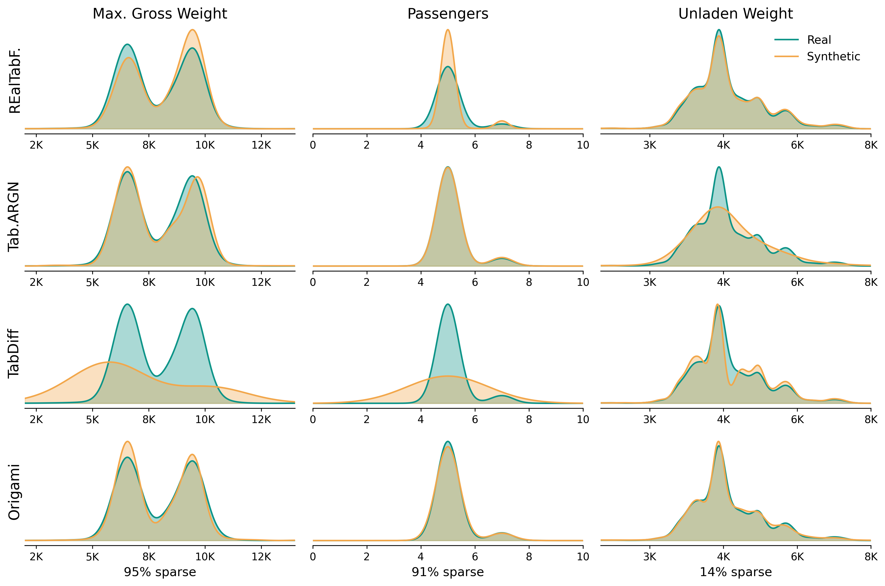

# Horizontal Slides

Use `---` to separate horizontal slides.

Use `----` for vertical slides (press down).

----

# Vertical Slide 1

This is a vertical sub-slide.

Navigate with arrow keys or swipe.

----

# Vertical Slide 2

You can organize sections vertically.

---

# Fragments

Show content incrementally:

- First point <!-- .element: class="fragment" -->
- Second point <!-- .element: class="fragment" -->
- Third point <!-- .element: class="fragment" -->

---

# Code

```python
class AgentPipeline:
    def run(self, goal: str) -> Result:
        plan = self.decompose(goal)
        for task in plan.topological_sort():
            result = self.execute(task, retries=3)
            score = self.evaluate(result)
            if score < task.threshold:
                plan.replan(task, feedback=score.reason)
            text = f"this {{variable}} is a temp"
		return self.aggregate(plan.results)
        
```

---

# Math

Inline: $E = mc^2$

Display:

$$
\mathcal{L}(\theta) = \mathbb{E}_{x \sim p_{\text{data}}} [\log D(x)] + \mathbb{E}_{z \sim p_z} [\log(1 - D(G(z)))]
$$

---

# Images

Use standard markdown image syntax:

```markdown

```

Or for more control:

```html

```

---

<!-- .slide: data-background="#0d9488" -->

# Custom Backgrounds

Use `<!-- .slide: data-background="#color" -->` for per-slide styling.

---

# Keyboard Shortcuts

| Key | Action |
|-----|--------|
| `→` / `↓` | Next slide |
| `←` / `↑` | Previous slide |
| `S` | Speaker notes |
| `F` | Fullscreen |
| `O` | Overview mode |
| `Esc` | Exit overview |

---

# Agent Architecture Overview

Our autonomous agent pipeline processes tasks through three coordinated stages, each with built-in evaluation and fallback mechanisms.

- **Task Decomposition** — breaks complex goals into atomic subtasks
  - Uses chain-of-thought prompting for planning
  - **Dependency** graph ensures _correct_ execution order
  - Estimated cost and latency per subtask
- **Execution Engine** — runs subtasks with tool access
  - Sandboxed environments for code execution
  - Retry logic with exponential backoff
  - Real-time trace logging for observability


<!-- ```python
class AgentPipeline:
    def run(self, goal: str) -> Result:
        plan = self.decompose(goal)
        for task in plan.topological_sort():
            result = self.execute(task, retries=3)
            score = self.evaluate(result)
            if score < task.threshold:
                plan.replan(task, feedback=score.reason)
        return self.aggregate(plan.results)
``` -->

---

# Mixed Content Slide

## Section heading

This is a regular paragraph with some **bold text** and *italic emphasis* and `inline code`. It wraps naturally across lines when there is enough content to fill the width.

### Subsection

- Top-level bullet point
- Another bullet with a sub-list
  - Nested item one
  - Nested item two
- Final top-level item

> A blockquote to illustrate pull-quote styling in presentations.

---

## EV Charging Demand


<div style="font-size: 0.75em; display: grid; grid-template-columns: 2fr 3fr; gap: 2em; align-items: center; height: 100%;">
<div>

- Demand peaks strongly between **6–9pm**
- Secondary morning peak around **7–9am**
- Low overnight charging despite cheaper rates
- **Implication:** grid stress coincides with residential load

</div>
<div>



</div>
</div>

---

# Thanks!

[relcon.ai](https://relcon.ai)
