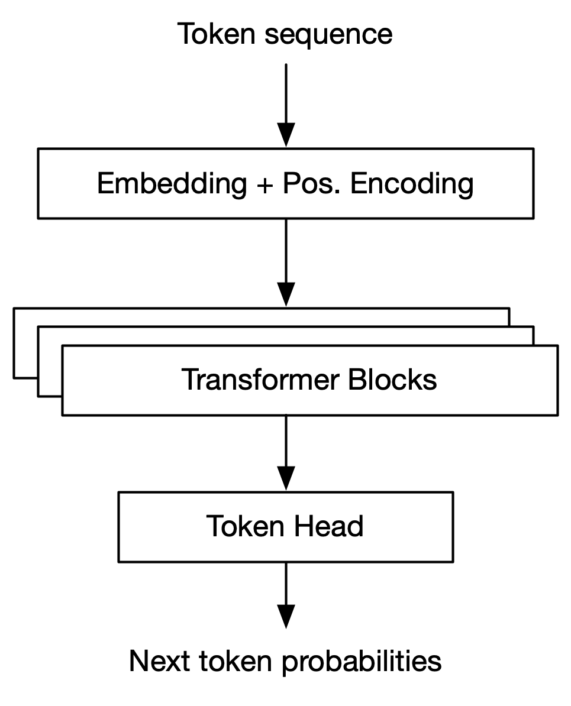
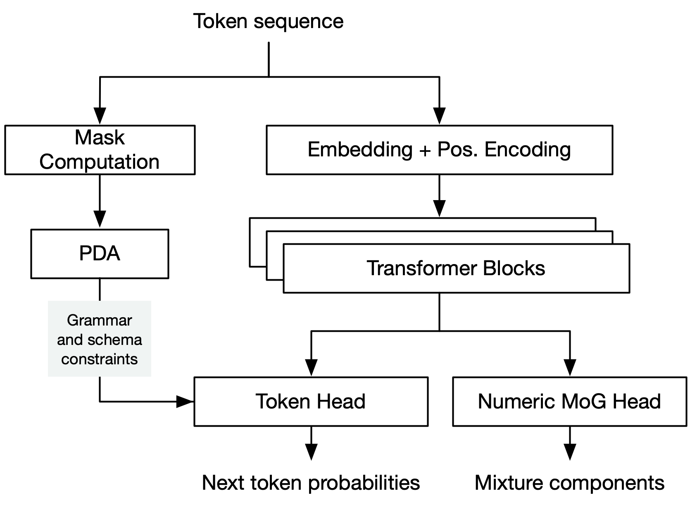
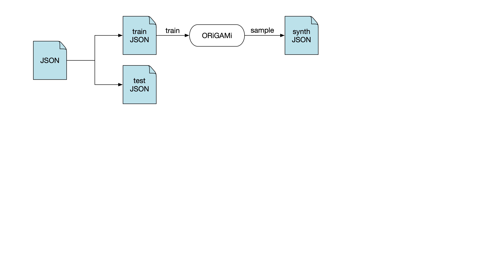
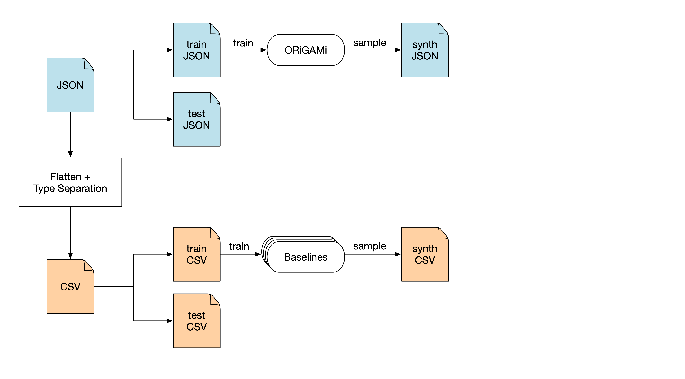
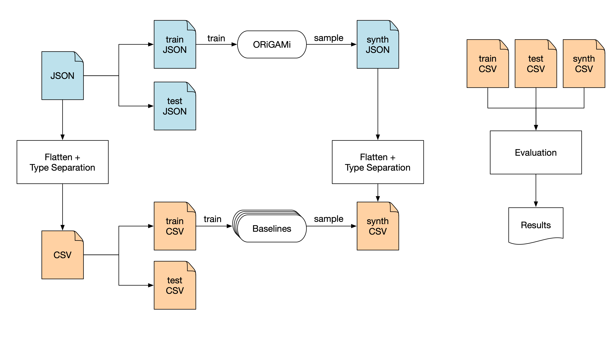
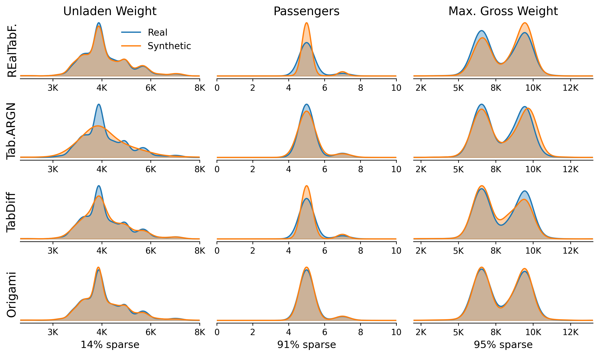
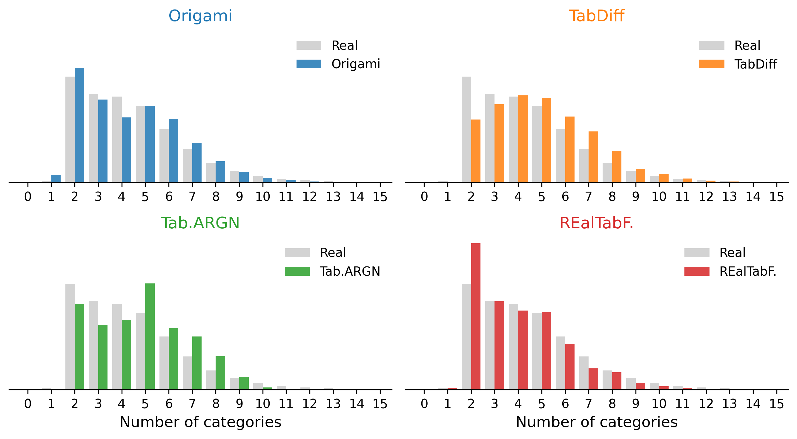
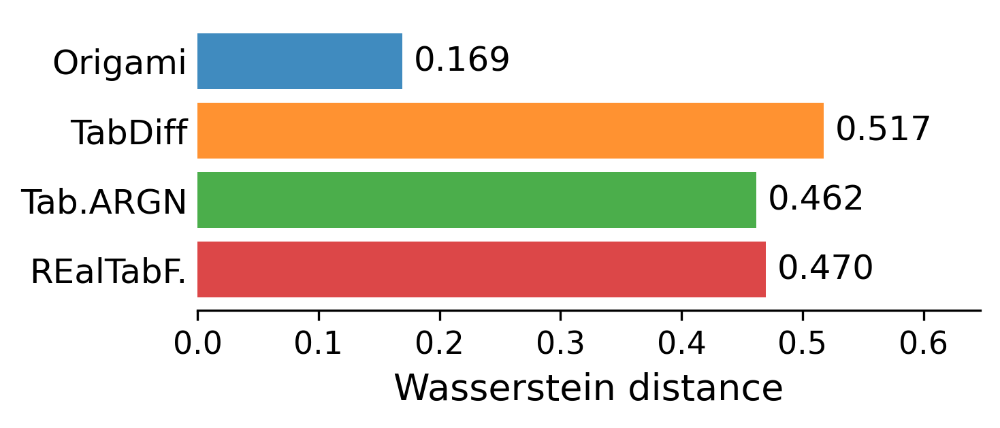

# Why do we need synthetic data?

> Synthetic data should be **statistically indistinguishable** from real data — same distributions, same correlations, same structure.

- **Privacy & compliance** — share or publish sensitive datasets without exposing PII<br>(e.g. GDPR, HIPAA compliance)
<!-- .element: class="fragment" -->

- **Dev & test environments** — realistic data for development and QA, without prod access
<!-- .element: class="fragment" -->

- **Benchmarking** — generate data at arbitrary scale with controlled properties 
<!-- .element: class="fragment" -->

- **Database tuning** — index selection, physical design, workload simulation
<!-- .element: class="fragment" -->

- **ML training** — augment rare classes, bootstrap training data for downstream models
<!-- .element: class="fragment" -->
 

Notes:
- ML training example synthetic patient records to train disease classifier

---

# Synthetic Data Generation Methods

<!-- .slide: class="smaller" -->

Several different algorithm families exist:
<br><br>

<div style="display: grid; grid-template-columns: 1fr 1fr; gap: 1.5em; margin-top: 0.5em;">
<div style="border: 1px solid var(--r-accent); padding: 0.5em 1em;">

**Statistical**
Fit pair-wise column correlations parametrically. Fast but limited expressivity. *(Gaussian Copula)*

</div>
<div style="border: 1px solid var(--r-accent); padding: 0.5em 1em;">

**GANs**
Generator and discriminator trained adversarially. Good at realism, unstable to train. *(CTGAN)*

</div>
<div style="border: 1px solid var(--r-accent); padding: 0.5em 1em;">

**Diffusion**
Corrupt data with noise, learn to reverse it. State-of-the-art on dense tables. *(TabDiff, TabDDPM)*

</div>
<div style="border: 1px solid var(--r-accent); padding: 0.5em 1em;">

**Autoregressive**
Generate one variable at a time, conditioned on all previous -> LLMs <br> *(GReaT, REaLTabFormer, ORiGAMi)*

</div>
</div>

<br><br>
See also Synthetic Data Vault: <a href="http://sdv.dev/">http://sdv.dev/</a>

Notes:
- Autoregressive generation is also how LLMs generate text, one token at a time
- Some methods, e.g. GReaT and REaLTabFormer use a transformer architectures (GPT-2)

---

# Prior methods assume tabular data

<div style="display: grid; grid-template-columns: 4fr 3fr; gap: 1.5em;">
<div>

- Interface is usually Pandas `DataFrame` or CSV file
- Assumes fixed set of columns, each with primitive type (numbers, strings, booleans)
- Missing values (`NaN`) are often replaced during preprocessing
- None of the existing methods support nested data or complex types (arrays, objects)


</div>
<div>

CTGAN (`sdv` package):
```python
from sdv.single_table import CTGANSynthesizer

data = load_csv("titanic.csv")
synthesizer = CTGANSynthesizer(metadata)
synthesizer.fit(data)
```

TabularARGN (`mostly-ai` package)
```python
import pandas as pd
from mostlyai.sdk import MostlyAI
mostly = MostlyAI()
df = pd.read_csv("titanic.csv")
g = mostly.train(data=df)
```


</div>
</div>

---

# Data isn't always flat tables

<!-- .slide: class="smaller" -->

<div style="display: grid; grid-template-columns: 1fr 1fr; gap: 1.5em;">
<div>

Github Issue Events

```json
{
  "created_at": 1772315390,
  "action": "opened",
  "active_lock_reason": null, 
  "state_reason": null,
  "issue": {
    "state": "open",
    "locked": false,
    "comments": 12,
    "number": 89,
    "user": {
      "type": "User",
      "site_admin": false
    },
    "labels": [
      {"color": ["a2", "ee", "ef"], "default": true, "name": "bug"}, 
      {"color": ["00", "75", "ca"], "default": false},
      ...
    ],
  },
  "sub_issues_summary": {"total": 12, "completed": 8, "percent": 66.7}
  "has_milestone": false,
}

```
</div>
<div>

MongoDB Query on Github Issue Events

```json
[
  { "$match": {
      "action": "opened",
      "issue.state": "open"
  }},
  { "$addFields": {
      "issue.label_names": {
        "$map": {
          "input": "$issue.labels",
          "as": "l", "in": "$$l.name"
        }
      }
  }},
  { "$group": {
      "_id": "$issue.label_names",
      "open_issues":  { "$sum": 1 },
      "avg_comments": { "$avg": "$issue.comments" },
      "bot_authored": { "$sum": {
        "$cond": [{ "$eq": ["$issue.user.type", "Bot"] }, 1, 0]
      }}
  }},
  { "$sort": { "open_issues": -1 }}
]
```
</div>
</div>

Notes:
- Application-layer data is overwhelmingly exchanged as JSON format (REST APIs) and often stored (Document Databases)

---

# Just flatten it!


```json
{ "title": "Flash Gordon", "genres": [ "Action", "Adventure", "Sci-Fi" ], "awards": { "wins": 3, "nominations": 8 } }
{ "title": "Tron",         "genres": [ "Action", "Sci-Fi" ],              "awards": { "wins": "unknown" }           }
```
<br>

<div class="fragment">
Flatten into table:

<div style="padding-top: 1em;">

| title | genres.0 | genres.1 | genres.2 | awards.wins | awards.nominations |
|---|---|---|---|---|---|
| Flash Gordon | Action | Adventure | Sci-Fi | 3 | 8 |
| Tron | Action | Sci-Fi | `NULL` | "unknown" | `NULL` |
</div>
<div>

<br>

<div class="fragment" style="margin-top: 1em;">
Separate columns by type:

<div style="font-size: 0.72em; padding-top: 1em;">

| title | gen.0 | gen.1 | gen.2.dtype | gen.2.str | aw.wins.dtype | aw.wins.str | aw.wins.num | aw.noms.dtype | aw.noms.num |
|---|---|---|---|---|---|---|---|---|---|
| Flash Gordon | Action | Adventure | string | Sci-Fi | int | `NULL` |  3 | number | 8 |
| Tron | Action | Sci-Fi | missing | `NULL` | string | "unknown" | `NULL` |  missing | `NULL` |
</div>
</div>

---

# Why flattening breaks down

<!-- .slide: class="small" -->

Flattening JSON produces very wide tables with high sparsity (`NULL` values)

| Dataset           | # records | # columns    | # cat | # num | # bool | Sparsity |
|-------------------|-----------|-----------|-------|-------|--------|----------|
| Adult             | 48,842    | 15        | 9     | 6     | 0      | 0.0%     |
| Diabetes          | 81,413    | 37        | 24    | 13    | 0      | 0.0%     |
| Electric Vehicles | 210,011   | 18        | 13    | 6     | 0      | 11.1%    |
| DDXPlus           | 1,160,131 | 100       | 50    | 50    | 0      | 67.1%    |
| Yelp              | 150,346   | 142       | 53    | 6     | 73     | 77.8%    |
| GitHub Issues     | 642,099   | 461       | 330   | 18    | 113    | 93.0%    |

</div>

<div class="fragment" style="margin-top: 2em;">

- Models typically replace / impute  missing values during preprocessing

</div>

<div class="fragment" style="margin-top: 1em; border: 1px solid var(--r-accent); padding: 0.5em 1em 0em 1em; width: fit-content; background: var(--r-selection-bg);">

We argue that this sparsity is a **property of the data** and should be modelled instead of "fixed" during pre-processing.

</div>

---

# Tension between discrete and continuous representations

<!-- .slide: data-visibility="hidden" -->

- Mixed-type data contains both discrete (strings, booleans) and continuous (numerical) variables

- _GANs_ and _Diffusion models_ operate in continuous space
  - Require special handling for discrete variables
  - Column explosion: categorical columns -> one-hot encoding

- _Autoregressive models_ operate in discrete token space 
  - Require special handling for continuous variables
  - Vocabulary explosion: numerical columns -> binning

- Both camps compromise

---

# ORiGAMi Architecture

- **O**bject **R**epresentat**i**on via **G**enerative **A**utoregressive **M**odell**i**ng
- Models JSON as a sequence of tokens <!-- .element: class="fragment" --> 
- Uses the transformer architecture (same as LLMs) with modifications <!-- .element: class="fragment" --> 
  - Custom tokenisation scheme
  - Grammar and schema constraints
  - Dual-head architecture for joint token and continuous value prediction
- ORiGAMi models are ~1000x smaller than standard LLMs (millions vs. billions of parameters) <!-- .element: class="fragment" --> 
- Can be trained on commodity hardware (laptops, single GPUs) in a reasonable time frame (hours to days) <!-- .element: class="fragment" -->  
<br>

----

# Tokenisation

 <!-- .element: style="width: 80%;" -->

----

# Tokenisation

<!-- .slide: class="small" -->


```json
{ 
  "title": "Flash Gordon", 
  "genres": [ "Action", "Adventure", "Sci-Fi" ], 
  "awards": { "wins": 3, "nominations": 8 } 
}
```

<br> 

Standard tokenisation (GPT-5): 42 Tokens, Vocabulary size: ~200k

`{` `"` `title` `":` ` "` `Flash` ` Gordon` `",` ` "` `genres` `":` ` [` ` "` `Action` `",` ` "` `Adventure` `",` ` "` `Sci` `-Fi` `"` ` ],` ` "` `aw` `ards` `":` ` {` ` "` `wins` `":` ` ` `3` `,` ` "` `n` `ominations` `":` ` ` `8` ` }` ` }`

<br>
<span class="fragment">

ORiGAMi tokenisation: 19 Tokens, Vocabulary size: ~ 1k-10k (dataset dependent)

`START` `OBJ_START` `Key(title)`, `Flash Gordon`, `Key(genres)`, `ARR_START`, `Action`, `Adventure`, `Sci-Fi`, `ARR_END`, `Key(awards)`, `OBJ_START`, `Key(wins)`, `3`, `Key(nominations)`, `8`, `OBJ_END`, `OBJ_END` `END`

</span>

----

# Grammar & schema constraints

<!-- .slide: class="small" -->


Grammar constraints enforce **correct syntax**, e.g.

- `...` `OBJ_START` -> Only `Key(*)` or `OBJ_END` tokens allowed
- `...` `ARR_START` -> Only `ARR_END`, `ARR_START`, `OBJ_START`, or primitive value tokens allowed
- Enforced via pushdown automaton that tracks the current context and nesting level

<br>

<div class="fragment">

Schema constraints enforce **semantic validity**, e.g.
- `...` `Key(genres)` -> Only values from the genres vocabulary allowed (`Action`, `Sci-Fi`, ...)
- `...` `Key(awards.wins)` -> Only numeric tokens allowed
- Enforced via masking of the output token probabilities based on the current context

</div>

Notes:
Model doesn't need to learn the grammar and schema constraints and can focus on the data distribution instead
- Smaller models
- Faster training
- No invalid samples

---

# Dual-head architecture

<!-- .slide: class="small" -->


<div style="display: grid; grid-template-columns: 3fr 5fr; gap: 1em;">

<div style="text-align: center">

<br>



## Standard Transformer
</div>
<div style="text-align: center" class="fragment">



<br>

## ORiGAMi Architecture

</div>
</div>


---

# Experimental setup



---

# Experimental setup



---

# Experimental setup



---

# Experiment Protocol

- All models trained on a single NVIDIA V100 GPU with 16GB VRAM
- Model training time is limited to 24 hours wall clock time per model and dataset
- We generate 10 synthetic sample files from each model with different seeds and report mean and stddev

---
 
# Evaluation Metrics

- **Fidelity** — how well does the synthetic data match the real data distribution? (single column and pairwise statistics)  
<!-- .element: class="fragment" -->

- **Detection** — how well can the synthetic data be distinguished from real data by a classifier? (C2ST protocol)  
<!-- .element: class="fragment" -->

- **ML Utility** — how well does the synthetic data support machine learning tasks? (TSTR / TRTR protocol) 
<!-- .element: class="fragment" -->

- **Privacy** — how well does the synthetic data protect sensitive information? (Distance to closest record, exact match rate) 
<!-- .element: class="fragment" -->

<br> 

For easier comparison, we normalise all metrics between 0 and 1 (higher is better).
<!-- .element: class="fragment" -->

---

# Results 

<div style="display: grid; grid-template-columns: 1fr 1fr; gap: 2em;">
<div style="font-size: 0.6em;">

## Fidelity

| Dataset | TVAE | CTGAN | REaLTabF. | Tab.ARGN | TabDiff | Origami |
| --- | --- | --- | --- | --- | --- | --- |
| Adult | 0.895 | 0.885 | 0.964 | 0.983 | 0.989 | **0.993** |
| Diabetes | 0.859 | 0.952 | 0.963 | 0.982 | 0.983 | **0.992** |
| Elec. Vehicles | ❌ | ❌ | 0.864 | 0.972 | 0.976 | **0.987** |
| DDXPlus | ❌ | ❌ | ❌ | 0.790 | 0.827 | **0.918** |
| Yelp | ❌ | ❌ | 0.911 | 0.884 | 0.837 | **0.950** |
| GitHub Issues | ❌ | ❌ | ❌ | 0.909 | 0.738 | **0.919** |

</div>

<div style="font-size: 0.6em;">

## Detection

| Dataset | TVAE | CTGAN | REaLTabF. | Tab.ARGN | TabDiff | Origami |
| --- | --- | --- | --- | --- | --- | --- |
| Adult | 0.255 | 0.220 | 0.825 | 0.882 | 0.957 | **0.972** |
| Diabetes | 0.002 | 0.564 | 0.692 | 0.904 | 0.880 | **1.000** |
| Elec. Vehicles | ❌ | ❌ | 0.394 | 0.783 | 0.940 | **1.000** |
| DDXPlus | ❌ | ❌ | ❌ | 0.411 | 0.082 | **0.587** |
| Yelp | ❌ | ❌ | 0.353 | 0.326 | 0.228 | **0.766** |
| GitHub Issues | ❌ | ❌ | ❌ | 0.630 | 0.265 | **0.665** |
</div>

<div style="font-size: 0.6em;">

## ML Utility

| Dataset | TVAE | CTGAN | REaLTabF. | Tab.ARGN | TabDiff | Origami |
| --- | --- | --- | --- | --- | --- | --- |
| Adult | 0.961 | 0.952 | 0.991 | 0.981 | 0.982 | **0.997** |
| Diabetes | 0.957 | 0.921 | 0.971 | 0.977 | 0.967 | **0.980** |
| Elec. Vehicles | ❌ | ❌ | 0.866 | 0.981 | 0.987 | **0.996** |
| DDXPlus | ❌ | ❌ | ❌ | **1.000** | **1.000** | **1.000** |
| Yelp | ❌ | ❌ | **0.987** | 0.974 | 0.950 | 0.971 |
| GitHub Issues | ❌ | ❌ | ❌ | 0.957 | 0.952 | **0.979** |

</div>

<div style="font-size: 0.6em;">

 ## Privacy

| Dataset | TVAE | CTGAN | REaLTabF. | Tab.ARGN | TabDiff | Origami |
| --- | --- | --- | --- | --- | --- | --- |
| Adult | 0.987 | **0.995** | 0.915 | 0.985 | 0.914 | 0.992 |
| Diabetes | 0.978 | **0.991** | 0.870 | 0.973 | 0.966 | 0.975 |
| Elec. Vehicles | ❌ | ❌ | 0.417 | 0.996 | 0.949 | **1.000** |
| DDXPlus | ❌ | ❌ | ❌ | **1.000** | 0.984 | **1.000** |
| Yelp | ❌ | ❌ | 0.909 | 0.959 | 0.994 | **0.970** |
| GitHub Issues | ❌ | ❌ | ❌ | **1.000** | **1.000** | **1.000** |

</div>

</div>

---


# Results — Detection

<div style="height: 560px;">
  <canvas id="detection-chart"></canvas>
</div>
<div class="chart-config" data-chart="detection-chart" style="display:none">
{
  "type": "bar",
  "data": {
    "labels": ["Adult (0%)", "Diabetes (0%)", "Electric (11%)", "DDXPlus (67%)", "Yelp (78%)", "GitHub (93%)"],
    "datasets": [
      { "label": "TVAE",          "data": [0.255, 0.002, null, null, null, null], "backgroundColor": "rgba(148,103,189,0.75)" },
      { "label": "CTGAN",         "data": [0.220, 0.564, null, null, null, null], "backgroundColor": "rgba(140,86,75,0.75)"   },
      { "label": "REaLTabFormer", "data": [0.825, 0.692, 0.394, null, 0.353, null], "backgroundColor": "rgba(214,39,40,0.75)" },
      { "label": "TabularARGN",   "data": [0.882, 0.904, 0.783, 0.411, 0.326, 0.630], "backgroundColor": "rgba(44,160,44,0.75)" },
      { "label": "TabDiff",       "data": [0.957, 0.880, 0.940, 0.082, 0.228, 0.265], "backgroundColor": "rgba(255,127,14,0.75)" },
      { "label": "ORiGAMi",       "data": [0.972, 1.000, 1.000, 0.587, 0.766, 0.665], "backgroundColor": "rgba(31,119,180,0.85)" }
    ]
  },
  "options": {
    "responsive": true,
    "maintainAspectRatio": false,
    "plugins": { "legend": { "position": "top" } },
    "scales": {
      "y": { "min": 0, "max": 1.0, "title": { "display": true, "text": "Detection Score" } },
      "x": {                        "title": { "display": true, "text": "Dataset (sparsity)" } }
    }
  }
}
</div>


---

# Numerical columns on _Electric Vehicles_


 <!-- .element: style="width: 80%;" -->

---

<!-- .slide: data-visibility="hidden" -->

# Numerical columns on _Electric Vehicles_

- TabularARGN uses a binning approach for numerical columns
  - Intra-bin uniform sampling smoothes out spikes in the distribution

- TabDiff uses mean imputation for missing values
  - For sparse columns, this results in significant over-representation of the mean value

---

# Array lengths on _Yelp_ `categories`

<!-- .slide: class="smaller" -->

<div style="display: grid; grid-template-columns: 3fr 2fr; gap: 1em; align-items: center;">
<div>



</div>
<div>

- Wasserstein distance between real and synthetic distributions of array lengths
- Due to flattening, baselines have no way to model array length directly

<br> 



</div>
</div>

---

# Summary

- Synthetic data generation is well-studied for tabular data, but not for nested, semi-structured data
- The flattening approach is possible but leads to sparse, high-dimensional tables 
- ORiGAMi addresses these challenges by directly modeling semi-structured data
- Strong results across all metrics and datasets, more pronounced as data gets more complex and sparse
- Our contributions include:
  - ORiGAMi as a semi-structured data synthesis architecture
  - Modifications to metrics evaluations that capture type and structural fidelity
  - We release our code and datasets for reproducibility and future research