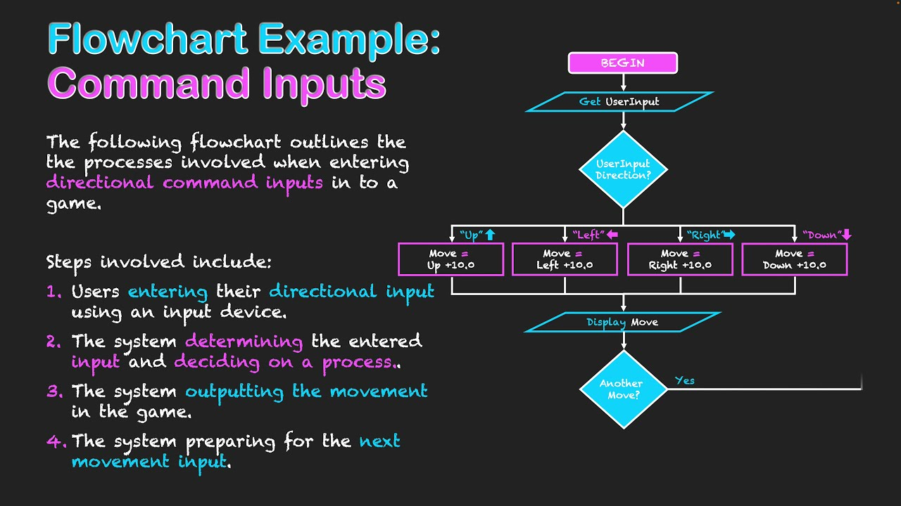

# Colloquium on reveal.js

A reference deck for colloquium-flavoured markdown running through our
reveal.js pipeline. The same file is intended to build cleanly under
the upstream `colloquium build` CLI too.

---

## Section 1 — Structural layouts

<!-- align: center -->
<!-- valign: center -->

Columns, rows, and nested row-columns.

---

## Columns (equal)

<!-- columns: 2 -->

### Left

- One
- Two
- Three

|||

### Right

Some prose, then bullets.

- Four
- Five
- Six

---

## Columns (60/40)

<!-- columns: 60/40 -->

Wider left column with a longer paragraph that wraps naturally. A
common pattern — dense text on one side, a narrow visual or side
note on the other.

|||

```python
def hello(name):
    return f"hi {name}"
```

---

## Columns (three)

<!-- columns: 3 -->

### One

Equal thirds.

|||

### Two

Good for side-by-side-by-side comparisons.

|||

### Three

Or three-column bullet dumps.

---

## Rows (20/80)

<!-- rows: 20/80 -->

Short top row: context or takeaway.

===



---

## Nested row-columns

<!-- rows: 40/60 -->

<!-- row-columns: 40/60 -->

**Setup** — a compact left-hand note.

|||

- Right side holds the bulleted detail
- Each item can be a full sentence
- Or a terse keyword

===

Bottom row is full-width. Use it for a figure, a quote, or a result
table that benefits from horizontal space.

---

## Section 2 — Fragments & animations

<!-- align: center -->
<!-- valign: center -->

`animate: bullets`, `animate: blocks`, and `<!-- step -->` groups.

---

## Animate bullets

<!-- animate: bullets -->

- First point appears
  - sub bullets reveal with their parent
  - another sub bullet
- Second point on next click
- Third point after that
- And a fourth

---

## Animate blocks

<!-- animate: blocks -->

This paragraph appears first.

This one appears second.

- A list reveals as one block
- Second bullet in the same block

```python
# Code block appears last
print("hello")
```

---

## Step markers

Visible immediately — the setup.

<!-- step -->

Middle part revealed on first click.

<!-- step -->

And the conclusion on the next click.

---

## Steps inside columns

<!-- columns: 2 -->

### Always visible

- Two fixed bullets
- Always on the left

<!-- step -->

Revealed on click — still in the left column.

|||

### Static right

Right column has no step markers. Its content stays put while the
left column reveals its step.

---

## Section 3 — Footnotes

<!-- align: center -->
<!-- valign: center -->

Inline `^[..]` and slide-level `<!-- footnote -->` prose.

---

## Inline footnotes

Autoregressive generation^[One token at a time, conditioned on all
previous tokens.] has become the default approach for text, and more
recently for tabular and nested data^[See GReaT, REaLTabFormer, and
ORiGAMi for tabular autoregressive work.].

Footnotes default to the right.

---

## Inline footnotes (left side)

<!-- footnotes: left -->

Switching the default side with `<!-- footnotes: left -->` puts
inline numbered footnotes^[Now bottom-left instead of bottom-right.]
on the left stack.

---

## Slide-level footnotes

<!-- footnote: A left-aligned caveat attached to this slide. -->
<!-- footnote-right: Right-side note, e.g. a venue reference. -->

Main content lives here. Slide-level footnotes render as italic
prose in the bottom-left / bottom-right zones. No numbering.

---

## Inline + slide-level together

<!-- footnote-right: Slide-level caveat on the right. -->

Autoregressive tables^[See GReaT and ORiGAMi.] can compose with a
slide-level note — numbered inline items stack above prose notes on
the same side.

---

## Section 4 — Callout boxes

<!-- align: center -->
<!-- valign: center -->

```box``` fenced elements with YAML config.

---

## Box: accent + content

```box
title: Core idea
tone: accent
content: |
  - Far simpler to implement
  - Far cheaper to run
  - Often reaches most of the final performance
```

---

## Box tones + compact

<!-- columns: 2 -->

```box
title: Muted
tone: muted
compact: true
content: |
  - Softer supporting panel
  - Uses the code background
  - Good for side caveats
```

|||

```box
title: Surface
tone: surface
compact: true
content: |
  - Neutral bordered panel
  - Best for references or notes
  - Sits quietly next to main content
```

---

## Title-only box

```box
title: "One-line statement of the core finding."
tone: accent
```

---

## Section 5 — Images

<!-- align: center -->
<!-- valign: center -->

Captions, alignment, vertical alignment, fill, overflow.

---

## Figure captions

Non-empty alt text becomes a small centered caption below the image.
Empty alt renders a plain image with no caption.

<!-- columns: 2 -->

### With caption


|||

### Without caption


---

## img-align: center

<!-- img-align: center -->

Horizontally centered on a plain slide.


---

## img-align: right

<!-- img-align: right -->

Right-aligned.


---

## img-valign: bottom (rows)

<!-- rows: 50/50 -->
<!-- img-valign: bottom -->

Top row: image bottom-aligned inside its 50% track.


===

Bottom row: plain text for reference.

---

## img-valign: center (columns)

<!-- columns: 2 -->
<!-- img-valign: center -->

### Left

Short text on the left. The image on the right should vertically
center inside its column cell rather than sticking to the top.

|||


---

## img-fill

<!-- columns: 2 -->
<!-- img-fill: true -->

### Left

Left column text. Image on the right fills its cell — crops as
needed with `object-fit: cover`.

|||


---

## img-overflow

<!-- columns: 60/40 -->
<!-- img-overflow: true -->

### Left

Left column text. The right cell has `overflow: visible`, so a wide
image could bleed outside the track boundary.

|||


---

## Section 6 — Utility classes

<!-- align: center -->
<!-- valign: center -->

Text sizes, spacers, inline footnote block.

---

## Text size utilities

<span class="text-3xl">Hero text</span>

<span class="text-2xl">Emphasis text</span>

<span class="text-xl">A key takeaway</span>

Normal paragraph text.

<span class="text-sm">Dense detail</span> · <span class="text-xs">Footnote-sized aside</span>

---

## Spacers + colloquium-footnote

Short intro paragraph.

<div class="colloquium-spacer-lg"></div>

The large spacer above moves this further down.

<div class="colloquium-footnote">
Use `colloquium-footnote` inline for secondary context that should stay visually subordinate.
</div>

---

## Section 7 — Other directives

<!-- align: center -->
<!-- valign: center -->

Align, valign, size, padding, title, layout.

---

## Alignment + size

<!-- align: center -->
<!-- size: large -->

**Centered, one size larger.**

`size:` scales slide font-size (`small` · `normal` · `large`);
`align:` sets text alignment for the whole slide.

---

## valign: center

<!-- valign: center -->

A short body paragraph that's vertically centered in the slide box.

---

## valign: bottom

<!-- valign: bottom -->

A short body paragraph anchored to the bottom.

---

## padding: compact

<!-- padding: compact -->

`padding: compact` tightens the slide inset. Useful for tables or
wide code blocks that need every available pixel.

```python
# A wide code sample that benefits from compact padding.
def fit_on_slide(x, y, z, w, very_long_parameter_name):
    return {"x": x, "y": y, "z": z, "w": w, "p": very_long_parameter_name}
```

---

## title: hidden

<!-- title: hidden -->

## Hidden heading

The `## Hidden heading` above is suppressed via `<!-- title: hidden -->`.
Body content still renders normally.

---

## layout: section-break

<!-- layout: section-break -->

Custom layouts pass through as `slide--<name>` classes. Without
project-specific CSS for `.slide--section-break`, the slide renders
normally — add CSS in `baseof.html` to style specific layouts.

---

## Section 8 — Math & code

<!-- align: center -->
<!-- valign: center -->

MathJax + highlight.js still work as before.

---

## Math

Inline math: $E = mc^2$.

Display math:

$$
\mathcal{L}(\theta) = \mathbb{E}_{x \sim p_{\text{data}}}[\log D(x)] +
\mathbb{E}_{z \sim p_z}[\log(1 - D(G(z)))]
$$

---

## Code with highlighting

```python
from typing import Iterable

def autoregressive(tokens: Iterable[int], model) -> int:
    logits = model.forward(tokens)
    return int(logits.argmax())
```

```json
{"role": "assistant", "content": "Streaming one token at a time."}
```

---

# Thanks

<!-- valign: center -->
<!-- align: center -->

That's every supported feature.
