# Outline

1. Intro Thomas
2. Challenges applying ML to semi-structured data
3. ORiGAMi: A new architecture for modelling JSON data
4. Applications ORiGAMi
5. Ongoing projects and future directions

---

# About me

- 2006–2011: PhD in Machine Learning, TU Munich (J. Schmidhuber)
  - Topics: neural networks , reinforcement learning, robotics
<!-- step -->
<div class="colloquium-spacer-md"></div>

- 2012-2025: MongoDB Australia
  - Roles: Technical Support, Program Manager, Engineering Lead, Research Scientist
  - 2022-2025: Head of ML Research (small group of 3 researchers)
  - Focus on ML for semi-structured data

<!-- step -->
<div class="colloquium-spacer-md"></div>

- 2026+: Independent Researcher
  - Founded my own "research lab" _Relaxed Constraints_ ([relcon.ai](https://relcon.ai))
  - Collaborations with Sydney University, MongoDB
  - Looking for more collaboration opportunities! 👋


---

# The Semi-Structured ML Gap


<div class="colloquium-spacer-md"></div>

<!-- step --> 

```box
tone: surface
align: center
content: |
  There is no broadly adopted, native modelling paradigm for JSON comparable to<br>XGBoost for tables or transformers for text.
```
---

<!-- columns: 1/1 -->
<!-- size: small -->

#### Operational Data (Yelp Business Listing)

```json
  {
    "business_id": "8KMIT0NXu30Jz5Ojo5uxaw",
    "name": "Cornerstone Physical Therapy Associates",
    "city": "Bensalem",
    "state": "PA",
    "postal_code": "19020",
    "stars": 5,
    "review_count": 6,
    "attributes": { 
      "BusinessAcceptsCreditCards": true, 
      "ByAppointmentOnly": true 
    },
    "categories": [ "Fitness & Instruction", "Physical Therapy" ],
    "hours": {
      "Monday": "9:0-19:0",
      ...
      "Friday": "9:0-15:0"
    }
  }
```

#### Structured Log Files

```json
{"t":{"$date":"2026-05-07T16:29:54.862+10:00"}, "s":"I", "c":"CONTROL", "id":5945603, "ctx":"thread1", "msg":"Multi threading initialized"}
{"t":{"$date":"2026-05-07T16:29:54.863+10:00"}, "s":"I", "c":"NETWORK", "id":4648601, "ctx":"thread1", "msg":"Implicit TCP FastOpen unavailable. If TCP FastOpen is required, set at least one of the related parameters","attr":{"relatedParameters":["tcpFastOpenServer","tcpFastOpenClient","tcpFastOpenQueueSize"]}}
{"t":{"$date":"2026-05-07T16:29:54.865+10:00"}, "s":"I", "c":"NETWORK", "id":4915701, "ctx":"thread1", "msg":"Initialized wire specification","attr":{"spec":{"incomingExternalClient":{"minWireVersion":0,"maxWireVersion":25},"incomingInternalClient":{"minWireVersion":0,"maxWireVersion":25},"outgoing":{"minWireVersion":6,"maxWireVersion":25},"isInternalClient":true}}}
{"t":{"$date":"2026-05-07T16:29:54.866+10:00"}, "s":"I", "c":"TENANT_M", "id":7091600, "ctx":"thread1", "msg":"Starting TenantMigrationAccessBlockerRegistry"}
{"t":{"$date":"2026-05-07T16:29:54.867+10:00"}, "s":"I", "c":"CONTROL", "id":4615611, "ctx":"initandlisten", "msg":"MongoDB starting","attr":{"pid":34839,"port":27018,"dbPath":"/Users/thomas/mongodb/data/db","architecture":"64-bit","host":"Beast.local"}}
```

|||

#### Query Language (MongoDB Aggregation Pipelines)

```json
[
  {
    "$group": {
      "_id": { "customerId": "$customer_id" },
      "firstOrder": { "$min": "$ROOT" }
    }
  },
  {
    "$replaceRoot": {
      "newRoot": { "$mergeObjects": ["$firstOrder", "$ROOT"] }
    }
  },
  {
    "$project": {
      "firstOrder": false
    }
  },
  {
    "$set": {
      "items": [
        { "sku": "BK-1042", "quantity": 2, "unitPrice": 19.99 },
        { "sku": "HD-8821", "quantity": 1, "unitPrice": 89.5 },
        { "sku": "CB-3308", "quantity": 3, "unitPrice": 7.25 },
        { "sku": "DS-0917", "quantity": 1, "unitPrice": 14.0 }
      ]
    }
  },
  {
    "$unwind": {
      "path": "$items"
    }
  },
  {
    "$replaceRoot": {
      "newRoot": "$items"
    }
  },
  {
    "$set": {
      "lineTotal": {
        "$multiply": ["$quantity", "$unitPrice"]
      }
    }
  },
  {
    "$addFields": {
      "customer": {
        "id": "$customerId"
      }
    }
  },
  {
    "$lookup": {
      "from": "products",
      "as": "product",
      "let": {},
      "pipeline": [
        {
          "$project": {
            "internalCost": false
          }
        }
      ]
    }
  },
  {
    "$unwind": {
      "path": "$product"
    }
  },
  {
    "$replaceRoot": {
      "newRoot": {
        "$mergeObjects": ["$ROOT", "$product"]
      }
    }
  },
  {
    "$project": {
      "sku": true,
      "quantity": true,
      "unitPrice": true,
      "lineTotal": true,
      "category": true,
      "customer": true
    }
  },
  {
    "$set": {
      "audit": {
        "source": "nightly-order-rollup"
      }
    }
  },
  {
    "$addFields": {
      "processedAt": {
        "$date": "2026-05-07T16:29:54.862Z"
      }
    }
  },
  {
    "$merge": {
      "into": {
        "db": "analytics",
        "coll": "daily_order_items"
      },
      "on": "sku",
      "whenMatched": "replace",
      "whenNotMatched": "insert"
    }
  }
]

```

---

# JSON was everywhere at MongoDB

- Data stored in MongoDB
- MongoDB Query Languages (`find()` and `aggregate()` syntax)
- MongoDB log files
- Configuration Files
- Query Profiling / Explain outputs
- Atlas Telemetry data
- Index definitions
- REST APIs
- ... 

--- 

# How do you apply ML to this data for... 

- Predictive modelling for our customers
  - Fraud detection
  - User segmentation
  - Churn prediction
- Cardinality estimation for query optimisation
- Index recommender systems
- Learned Indexes
- Approx. query processing for analytics and visualisation
- Database Knob Tuning
- Semantic (vector) search over JSON records
- ... 

---

# Approaches we tried

<!-- animate: bullets -->

- **Manual feature engineering + classical ML models**
  - requires domain expertise, doesn't scale
- **Flattening JSON into tabular format + classical ML models**
  - extreme sparsity, loses structure, doesn't scale
- **Graph- and Tree-based models (e.g. GNNs, Tree-LSTMs, ...)**
  - too restrictive assumptions for schemaless JSON
- **Throw it into an LLM and hope for the best**
  - only works for tiny datasets, no guarantees, expensive

---

# Searching for a new paradigm

<!-- img-align: center -->

- Going from tabular to semi-structured (loosening constraints) didn't work
- Going from unstructured (LLMs) to semi-structured (adding constraints) was more promising

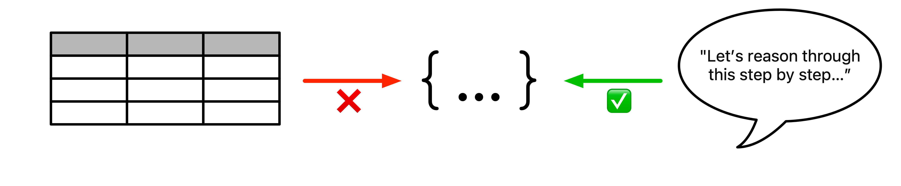

---

# ORiGAMi

> **O**bject **R**epresentation v**i**a **G**enerative **A**utoregressive **M**odell**i**ng

<div class="colloquium-spacer-md"></div>

#### Key ideas

- Represent JSON as sequences of tokens
- Autoregressive next-token prediction with transformers
- Structural constraints (inductive bias) through 
  1. Custom tokenisation: keys, values, structural tokens
  2. Order-invariant position encoding and key shuffling (JSON keys are unordered)
  3. Grammar and schema constraints via constrained decoding

---

# ORiGAMi Tokenisation


----

## Standard BPE vs. ORiGAMi Tokenisation

Standard tokenisation (GPT-5):
42 tokens, vocabulary size ~200k

`{` `"` `title` `":` ` "` `Flash` ` Gordon` `",` ` "` `genres` `":` ` [` ` "` `Action` `",` ` "` `Adventure` `",` ` "` `Sci` `-Fi` `"` ` ],` ` "` `aw` `ards` `":` ` {` ` "` `wins` `":` ` ` `3` `,` ` "` `n` `ominations` `":` ` ` `8` ` }` ` }`

<!-- step -->
<div class="colloquium-spacer-lg"></div>

ORiGAMi tokenisation:
19 tokens, vocabulary size ~1k-10k (dataset dependent)

`START` `OBJ_START` `Key(title)` `Flash Gordon` `Key(genres)` `ARR_START` `Action` `Adventure` `Sci-Fi` `ARR_END` `Key(awards)` `OBJ_START` `Key(wins)` `3` `Key(nominations)` `8` `OBJ_END` `OBJ_END` `END`

---

# ORiGAMi Architecture

<!-- columns: 3/5 -->
<!-- size: small -->
<!-- align: center -->

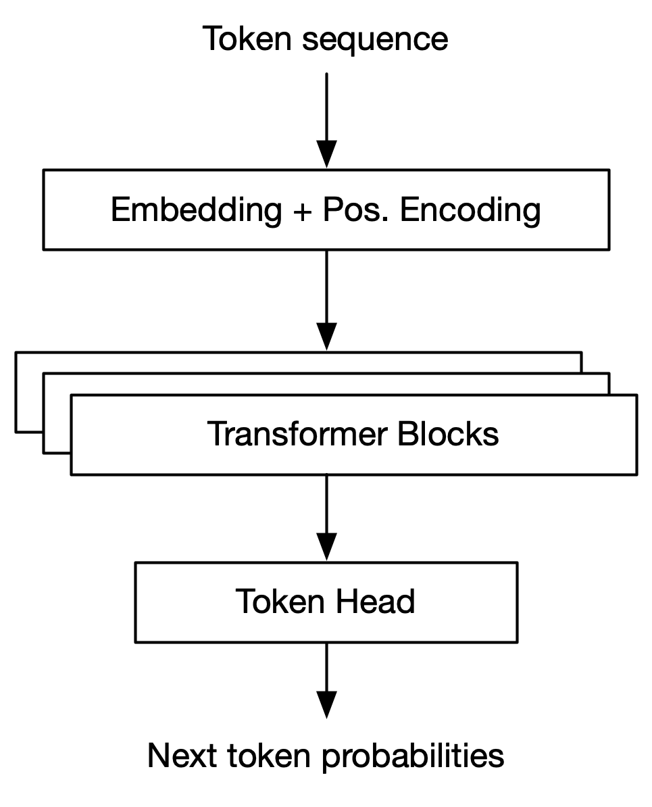

|||

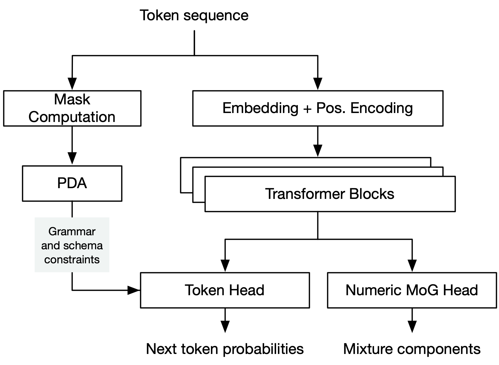


----

# Grammar & schema constraints

<!-- rows: 1/1 -->
<!-- size: small -->
<!-- padding: compact -->

```box
title: Grammar constraints
tone: surface
compact: false
content: |
  Enforce **correct syntax**.

  - `...` `OBJ_START` -> only `Key(*)` or `OBJ_END`
  - `...` `ARR_START` -> only `ARR_END`, `ARR_START`, `OBJ_START`, or primitive values
  
  Implemented as a pushdown automaton tracking context and nesting level
```

===

<!-- step -->

```box
title: Schema constraints
tone: surface
compact: false
content: |
  Enforce **semantic validity**.

  - `...` `Key(genres)` -> only values from the genres vocabulary
  - `...` `Key(awards.wins)` -> only numeric tokens

  Implemented by masking output probabilities based on the current context
```

Notes:
Model doesn't need to learn grammar and schema constraints and can focus on the
data distribution instead.
- Smaller models
- Faster training
- No invalid samples

---

# Causal models are density estimators

We represent JSON record $\mathbf{x}$ as a sequence of tokens $x_0, x_1, \ldots, x_T$ and train ORiGAMi to predict the next token given the previous ones.

Chain rule of probability:
$$
p(\mathbf{x}) = \underbrace{p(x_0) \cdot p(x_1 | x_0) \cdots p(x_T | x_{< T})}_{\text{written as product of conditionals}} = \prod_{t=0}^T p(x_t | x_{< t})
$$

With $p(x_t | x_{< t}) = p($ `?` | `START` `OBJ_START` `Key(name)` `Thomas` `...` $)$ being the output of the model at each step, we can compute the likelihood of any JSON record under the model.

---

# Application
## Predictive Modeling from JSON data

---

<!-- img-valign: center -->

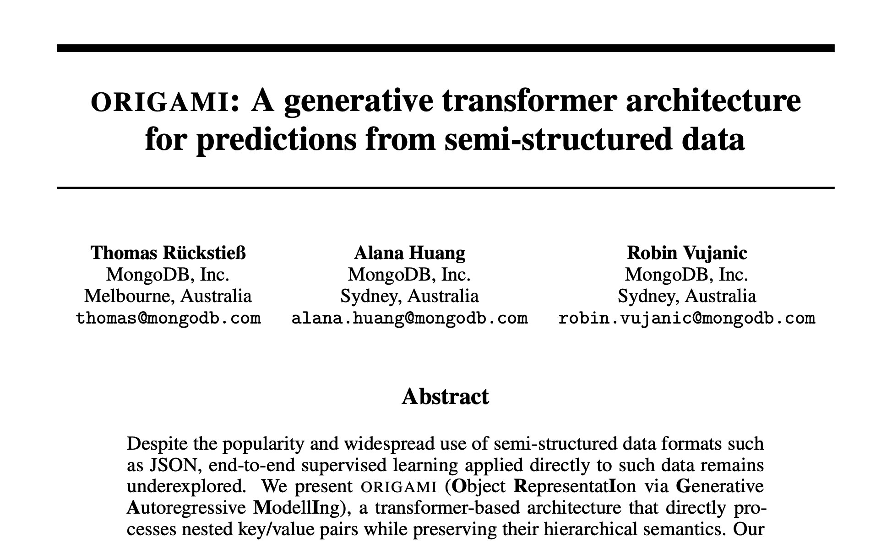

---

# Making predictions with ORiGAMi

<!-- size: small -->

```box
tone: surface
style: compact
content: |
  Due to key shuffling during training, we can access conditionals for any key to predict the next value:
  $$
  \hat{y}
  = \arg\max_y p_\theta(y \mid x_{\mathrm{obs}}, k_y)
  $$
  where $k_y$ is the target key placed after the observed key-value pairs $x_{\mathrm{obs}}$.
```

<!-- step --> 

<div class="colloquium-spacer-md"></div>

To predict the `stars` rating for a Yelp business:

`START` ... `Key(city)` `Melbourne` `Key(categories)` `ARR_START` ... `ARR_END` `Key(stars)` → `?`

<!-- step -->

<div class="colloquium-spacer-md"></div>

- Scalar value: choose the most likely next token ($\arg \max$)
- Array/object value: decode the most likely value sequence (e.g. beam search)
- Advantage over discriminative models $p(y | \mathbf{x})$: Same model can target different keys at inference time

---

# Results CodeNet Java 250

<!-- columns: 3/2 -->
<!-- size: small -->

- 75,000 Java code snippets collected from 250 online programming challenges
- Predict the challenge from the source code (250 classes)
- Baselines: dedicated code models based on MLP, CNN, GNN 
- For ORiGAMi, we parse code into ASTs stored as JSON -> 

| Metric | MLP | CNN | GNN | ORiGAMi |
|---|---:|---:|---:|---:|
| Accuracy (test) | 71.0% | 89.5% |94.1% | **94.7%** |


<span style="font-size: 0.65em;">

```java
import java.util.Arrays;
import java.util.Scanner;

public class Main {
  public static void main(String[] args) {
    Scanner sc = new Scanner(System.in);
    int N = sc.nextInt();
    int L = sc.nextInt();
    sc.nextLine();
    String[] s = new String[N];
    for(int i = 0; i < N; i++) {
      s[i] = sc.nextLine();
    }
    sc.close();
    Arrays.sort(s);
    for(int i = 0; i < N; i++) {
      System.out.print(s[i]);
    }
    System.out.println("");
  }
}
```

</span>

|||


<span style="font-size: 0.75em;">

```json
{
  "ast": {
    "type": "CompilationUnit",
    "imports": [
      {
        "type": "Import",
        "path": "java.util.Arrays",
        "static": false,
        "wildcard": false
      },
      {
        "type": "Import",
        "path": "java.util.Scanner",
        "static": false,
        "wildcard": false
      }
    ],
    "types": [
      {
        "type": "ClassDeclaration",
        "modifiers": [
          "public"
        ],
        "name": "Main",
        "body": [
          {
            "type": "MethodDeclaration",
            "modifiers": [
              "public",
              "static"
            ],
            "name": "main",
            "parameters": [
              {
                "type": {
                  "type": "ReferenceType",
                  "name": "String"
                },
                "name": "args",
                "varargs": false
              }
            ],
            "body": [
              {
                "type": {
                  "type": "ReferenceType",
                  "name": "Scanner"
                },
                "declarators": [
                  {
                    "type": "VariableDeclarator",
                    "name": "sc",
                    "initializer": {
                      "type": {
                        "type": "ReferenceType",
                        "name": "Scanner"
                      },
                      "arguments": [
                        {
                          "type": "MemberReference",
                          "qualifier": "System",
                          "member": "in"
                        }
                      ]
                    }
                  }
                ]
              },
              {
                "type": {
                  "type": "BasicType",
                  "name": "int"
                },
                "declarators": [
                  {
                    "type": "VariableDeclarator",
                    "name": "N",
                    "initializer": {
                      "type": "MethodInvocation",
                      "qualifier": "sc",
                      "member": "nextInt"
                    }
                  }
                ]
              },
              {
                "type": {
                  "type": "BasicType",
                  "name": "int"
                },
                "declarators": [
                  {
                    "type": "VariableDeclarator",
                    "name": "L",
                    "initializer": {
                      "type": "MethodInvocation",
                      "qualifier": "sc",
                      "member": "nextInt"
                    }
                  }
                ]
              },
              {
                "type": "StatementExpression",
                "expression": {
                  "type": "MethodInvocation",
                  "qualifier": "sc",
                  "member": "nextLine"
                }
              },
              {
                "type": {
                  "type": "ReferenceType",
                  "name": "String"
                },
                "declarators": [
                  {
                    "type": "VariableDeclarator",
                    "name": "s",
                    "initializer": {
                      "type": {
                        "type": "ReferenceType",
                        "name": "String"
                      },
                      "dimensions": [
                        {
                          "type": "MemberReference",
                          "qualifier": "",
                          "member": "N"
                        }
                      ]
                    }
                  }
                ]
              },
              {
                "type": "ForStatement",
                "control": {
                  "type": "ForControl",
                  "init": {
                    "type": {
                      "type": "BasicType",
                      "name": "int"
                    },
                    "declarators": [
                      {
                        "type": "VariableDeclarator",
                        "name": "i",
                        "initializer": {
                          "type": "Literal",
                          "value": "0"
                        }
                      }
                    ]
                  },
                  "condition": {
                    "type": "BinaryOperation",
                    "operator": "<",
                    "operandl": {
                      "type": "MemberReference",
                      "qualifier": "",
                      "member": "i"
                    },
                    "operandr": {
                      "type": "MemberReference",
                      "qualifier": "",
                      "member": "N"
                    }
                  },
                  "update": [
                    {
                      "type": "MemberReference",
                      "postfix_operators": [
                        "++"
                      ],
                      "qualifier": "",
                      "member": "i"
                    }
                  ]
                },
                "body": {
                  "type": "BlockStatement",
                  "statements": [
                    {
                      "type": "StatementExpression",
                      "expression": {
                        "type": "=",
                        "expressionl": {
                          "type": "MemberReference",
                          "qualifier": "",
                          "selectors": [
                            {
                              "type": "ArraySelector",
                              "index": {
                                "type": "MemberReference",
                                "qualifier": "",
                                "member": "i"
                              }
                            }
                          ],
                          "member": "s"
                        },
                        "value": {
                          "type": "MethodInvocation",
                          "qualifier": "sc",
                          "member": "nextLine"
                        }
                      }
                    }
                  ]
                }
              },
              {
                "type": "StatementExpression",
                "expression": {
                  "type": "MethodInvocation",
                  "qualifier": "sc",
                  "member": "close"
                }
              },
              {
                "type": "StatementExpression",
                "expression": {
                  "type": "MethodInvocation",
                  "qualifier": "Arrays",
                  "arguments": [
                    {
                      "type": "MemberReference",
                      "qualifier": "",
                      "member": "s"
                    }
                  ],
                  "member": "sort"
                }
              },
              {
                "type": "ForStatement",
                "control": {
                  "type": "ForControl",
                  "init": {
                    "type": {
                      "type": "BasicType",
                      "name": "int"
                    },
                    "declarators": [
                      {
                        "type": "VariableDeclarator",
                        "name": "i",
                        "initializer": {
                          "type": "Literal",
                          "value": "0"
                        }
                      }
                    ]
                  },
                  "condition": {
                    "type": "BinaryOperation",
                    "operator": "<",
                    "operandl": {
                      "type": "MemberReference",
                      "qualifier": "",
                      "member": "i"
                    },
                    "operandr": {
                      "type": "MemberReference",
                      "qualifier": "",
                      "member": "N"
                    }
                  },
                  "update": [
                    {
                      "type": "MemberReference",
                      "postfix_operators": [
                        "++"
                      ],
                      "qualifier": "",
                      "member": "i"
                    }
                  ]
                },
                "body": {
                  "type": "BlockStatement",
                  "statements": [
                    {
                      "type": "StatementExpression",
                      "expression": {
                        "type": "MethodInvocation",
                        "qualifier": "System.out",
                        "arguments": [
                          {
                            "type": "MemberReference",
                            "qualifier": "",
                            "selectors": [
                              {
                                "type": "ArraySelector",
                                "index": {
                                  "type": "MemberReference",
                                  "qualifier": "",
                                  "member": "i"
                                }
                              }
                            ],
                            "member": "s"
                          }
                        ],
                        "member": "print"
                      }
                    }
                  ]
                }
              },
              {
                "type": "StatementExpression",
                "expression": {
                  "type": "MethodInvocation",
                  "qualifier": "System.out",
                  "arguments": [
                    {
                      "type": "Literal",
                      "value": "\"\""
                    }
                  ],
                  "member": "println"
                }
              }
            ]
          }
        ]
      }
    ]
  },
  "problem": "p04044"
}
```

</span>

----


# Results DDXPlus

<!-- columns: 3/2 -->
<!-- size: small -->

- Medical diagnosis dataset from NeurIPS 2022 Datasets & Benchmarks Track 
- Predict differential diagnosis (list of possible diseases) from evidences
- Baselines train on flattened data with multi-output classification (MOC) for `DIFFERENTIAL_DIAGNOSIS` (49 classes)

<div class="colloquium-spacer-lg"></div>

| Metric | MOC LR | MOC RF | MOC XGBoost | MOC LightGBM | ORiGAMi |
|---|---:|---:|---:|---:|---:|
| F1 | 90.3% | 94.5% | 93.8% | 94.1% | **96.7%** |
| Precision | 89.7% | 93.3% | 92.4% | 92.9% | **96.2%** |
| Recall | 91.0% | 95.6% | 95.2% | 95.4% | **97.1%** |

|||

```json
{
  "AGE": 49,
  "SEX": "F",
  "INITIAL_EVIDENCE": "E_201",
  "EVIDENCES": {
    "E_53": [],
    "E_54": [ "V_112", "V_161", "V_180", "V_181" ],
    "E_55": [ "V_29", "V_101", "V_103" ],
    "E_56": [ "6" ],
    "E_57": [ "V_29", "V_101" ],
    "E_58": [ "3" ],
    "E_59": [ "2" ],
    "E_70": [],
    "E_78": [],
    "E_98": [],
    "E_140": [],
    "E_167": [],
    "E_173": [],
    "E_201": [],
    "E_204": [ "V_10" ],
    "E_217": []
  },
  "DIFFERENTIAL_DIAGNOSIS": [
    "Bronchitis",
    "GERD",
    "Possible NSTEMI / STEMI",
    "Unstable angina",
    "Pericarditis",
    "Anemia",
    "Stable angina",
    "Boerhaave"
  ]
}
```


---

# Application
## Synthetic Generation of JSON Data

---

<!-- img-valign: center -->

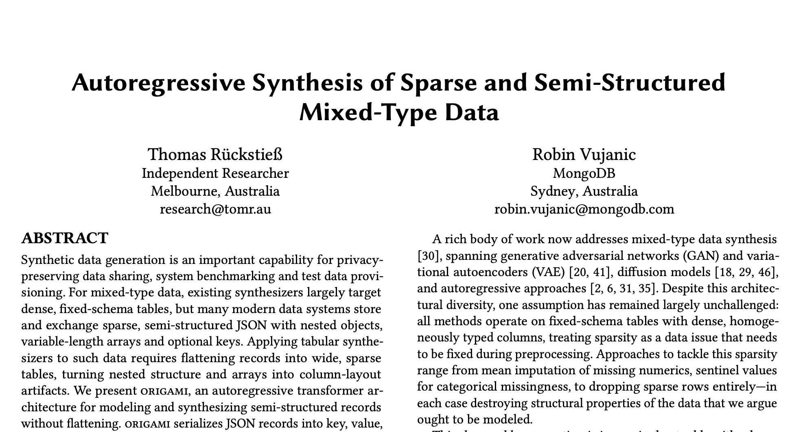

---

# Synthetic Data Generation

<!-- size: small -->

```box
tone: surface
content: |
  Train ORiGAMi model on JSON data, prompt with `START` token and sample until `END`.
```

- Baselines are trained on **flattened data**
  - Nested keys are dot-concatenated and create their own columns (e.g. `user.address.city`)
  - Arrays are flattened into multiple columns (e.g. `categories.0`, `categories.1`, ...)

<!-- step --> 

  - But this leads to extreme sparsity and wide tables

| Dataset           | # Records | # Columns | Sparsity |
|-------------------|----------:|----------:|---------:|
| Adult             | 48,842    | 15        | 0.0%     |
| Diabetes          | 81,413    | 37        | 0.0%     |
| Electric Vehicles | 210,011   | 18        | 11%      |
| DDXPlus           | 1,160,131 | 100       | 67%      |
| Yelp              | 150,346   | 142       | 78%      |
| GitHub Issues     | 642,099   | 461       | 93%      |


---

# Synthetic Data Generation: Baselines

#### Tabular Baselines:

  - **CTGAN** (tabular Generative Adversarial Network)
  - **TVAE** (tabular Variational Autoencoder)
  - **Tabby** (GPT-2 based, pre-trained)
  - **REalTabFormer** (GPT-2 based, trained from scratch)
  - **TabularARGN** (NADE-style MLP model)
  - **TabDiff** (diffusion model for tabular data)

<div class="colloquium-spacer-md"></div>
All models are trained on V100 GPU with 16GB VRAM for a max. of 24h wall-clock time

---

# Synthetic Data Generation: Metrics

<!-- animate: bullets -->

- **Fidelity** — how well does the synthetic data match the real data distribution? <br>
  (single-column and pairwise statistics)

- **Detection** — how well can the synthetic data be distinguished from real data
  by a classifier? <br> (C2ST protocol)

- **ML Utility** — how well does the synthetic data support machine learning tasks? <br>
  (TSTR / TRTR protocol)

- **Privacy** — how well does the synthetic data protect sensitive information? <br>
  (distance to closest record, exact match rate)

---

# Synthetic Data Generation: Results

- ORiGAMi is best (or tied-best) on 17/18 comparisons for fidelity, detection and ML utility
- ORiGAMi achieves >96% on privacy evaluations across all 6 datasets
- 4/6 baselines cannot train on the larger datasets due to limited memory

<div class="colloquium-spacer-md"></div>
<!-- step --> 
<div style="height: 560px;">
  <canvas id="detection-chart"></canvas>
</div>
<div class="chart-config" data-chart="detection-chart" style="display:none">
{
  "type": "bar",
  "data": {
    "labels": ["Adult (0%)", "Diabetes (0%)", "Electric (11%)", "Yelp (78%)", "GitHub (93%)", "DDXPlus (67%)"],
    "datasets": [
      { "label": "Tabby",         "data": [0.587, null,  null,  null,   null, null], "backgroundColor": "rgba(127,127,127,0.75)" },
      { "label": "TVAE",          "data": [0.218, 0.045, null,  null,   null, null], "backgroundColor": "rgba(148,103,189,0.75)" },
      { "label": "CTGAN",         "data": [0.112, 0.411, null,  null,   null, null], "backgroundColor": "rgba(140,86,75,0.75)"   },
      { "label": "REaLTabFormer", "data": [0.807, 0.696, 0.417, 0.327,  null, null], "backgroundColor": "rgba(214,39,40,0.75)" },
      { "label": "TabularARGN",   "data": [0.866, 0.896, 0.640, 0.341, 0.676, 0.400], "backgroundColor": "rgba(44,160,44,0.75)" },
      { "label": "TabDiff",       "data": [0.967, 0.885, 0.937, 0.427, 0.449, 0.133], "backgroundColor": "rgba(255,127,14,0.75)" },
      { "label": "ORiGAMi",       "data": [0.979, 1.000, 1.000, 0.772, 0.687, 0.558], "backgroundColor": "rgba(31,119,180,0.85)" }
    ]
  },
  "options": {
    "responsive": true,
    "maintainAspectRatio": false,
    "plugins": { "legend": { "position": "top" } },
    "scales": {
      "y": { "min": 0, "max": 1.0, "title": { "display": true, "text": "Detection Score" } },
      "x": {                        "title": { "display": true, "text": "Dataset (sparsity)" } }
    }
  }
}
</div>

---

# Synthetic Data Generation: Failure Modes

<!-- size: small -->

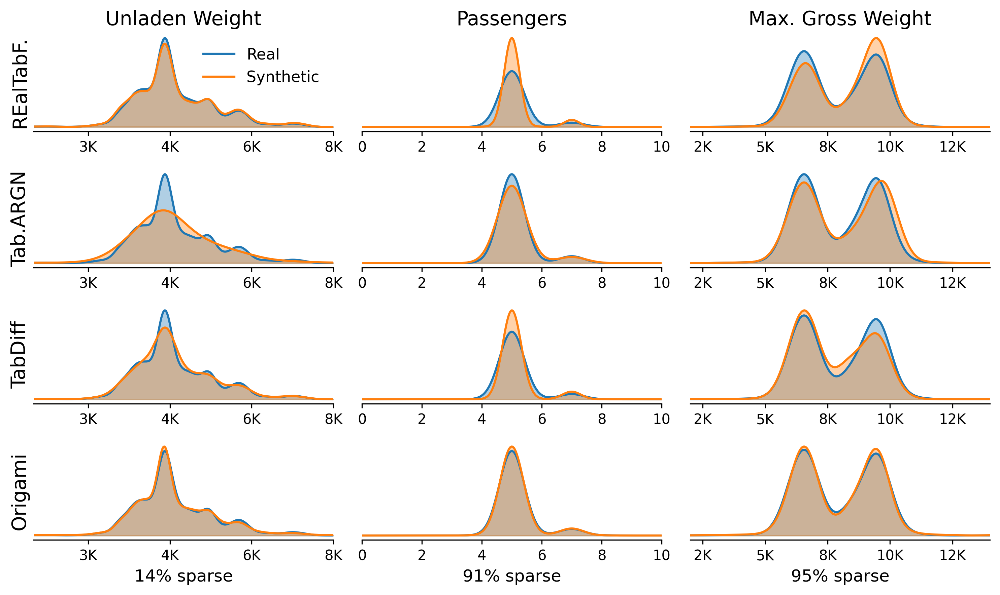

----

<!-- size: small -->

# Synthetic Data Generation: Failure Modes

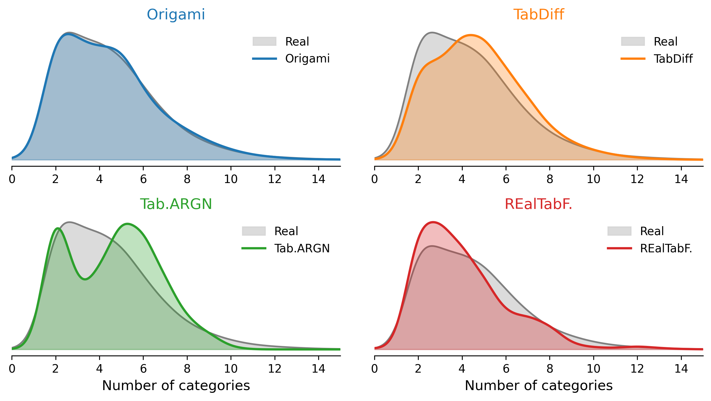

---

# Ongoing and Future Work

---

# Cardinality Estimation 

<!-- size: small -->

<!-- columns: 2/3 -->

Given some data

| $x_1$ | $x_2$ |
|---:|---:|
| 0.24 | 0.81 |
| 0.45 | 0.93 |
| ... | ... |

<div class="colloquium-spacer-lg"></div>

A query targets a region in this space, e.g. $0.6 < x_1 < 0.8$ and $0.7 < x_2 < 0.9$

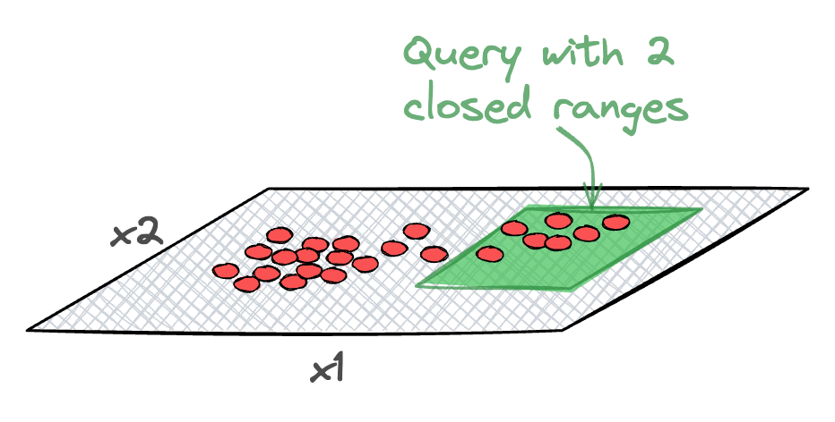

|||

How much of the volume of the probability density falls into the query region?

Multiplied with total number of records gives the cardinality estimate.

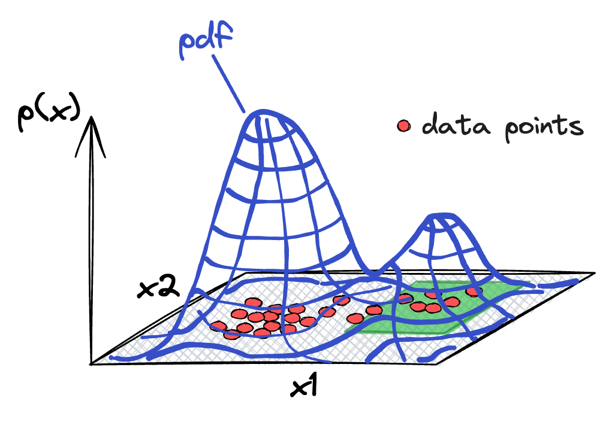

---

# Cardinality Estimation 

<!-- footnotes: left -->
<!-- size: small -->

<!-- rows: 1/1 -->

- Works like NaRU^[Yang, Zongheng, Eric Liang, Amog Kamsetty, et al. 2019. “Deep Unsupervised Cardinality Estimation.” Proceedings of the VLDB Endowment 13 (3): 279–92. VLDB 2019] and NeuroCard^[Yang, Zongheng, Amog Kamsetty, Sifei Luan, et al. 2021. “NeuroCard: One Cardinality Estimator for All Tables.” VLDB 2021] train NNs for tabular data
- They use Monte Carlo (importance) sampling to estimate the integral over the query region
- Same principle applies to ORiGAMi models:
  - We can sample records from the query region using the learned distribution as proposal distribution

<div class="colloquium-spacer-md"></div>

Query: `{ "genres": "Horror", "runtime": { "$lt": 60 } }`

===

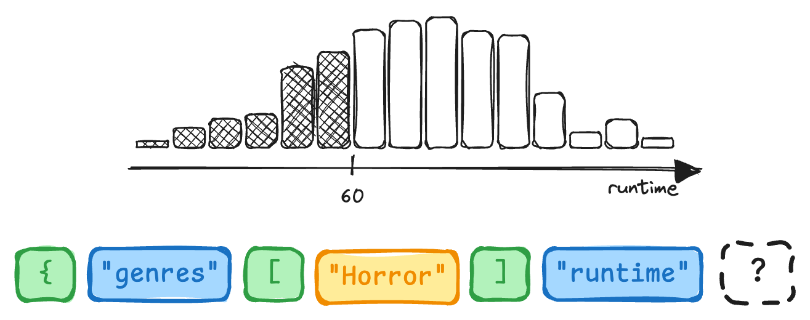

---

# Compression of Semi-Structured Data

- Train ORiGAMi model on dataset
- Assign shortest codes to most likely tokens at each position
  - Using Huffman or arithmetic coding
- Reverse the process for decompression

<div class="colloquium-spacer-md"></div>

Unsolved challenges:

- How to deal with unique IDs? 
- How to deal with high-cardinality numeric values?  (ORiGAMi's continuous head is lossy)
- No compression of free-form text fields (currently a single token in ORiGAMi)

---

# Query Embeddings for Index Advisor (USyd)

<!-- size: small -->
<!-- img-align: center -->

- Use the activations of the last hidden layer as a fixed-size embedding for a DB query
- Bao-style RL agent predicts best index given embedding

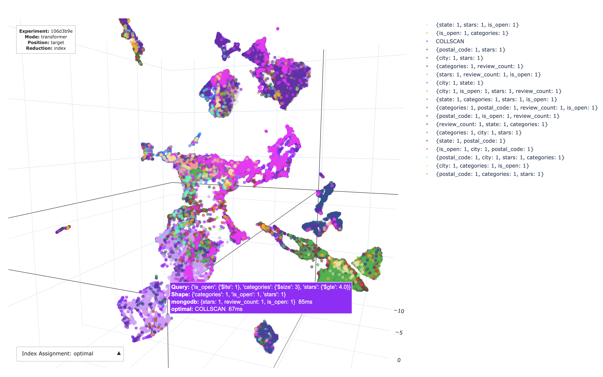

---

# Summary

1. **JSON is everywhere**, but it does not fit cleanly into tabular, graph, tree, or text modelling assumptions
2. **ORiGAMi models JSON natively** by combining autoregressive transformers with custom tokenisation, key-order invariance, and constrained decoding
3. **A density model over JSON is a reusable primitive** for prediction, synthetic data generation, cardinality estimation, compression, and potentially many more applications

--- 

## References

<!-- size: small -->

- Puri, Ruchir, David S. Kung, Geert Janssen, et al. 2021. **CodeNet: A Large-Scale AI for Code Dataset for Learning a Diversity of Coding Tasks.** NeurIPS 2021. https://doi.org/10.48550/arXiv.2105.12655.
- Fansi Tchango, Arsene, Rishab Goel, Zhi Wen, Julien Martel, and Joumana Ghosn. 2022. **Ddxplus: A New Dataset for Automatic Medical Diagnosis.** NeurIPS 2022. http://arxiv.org/abs/2205.09148
- Marcus, Ryan, Parimarjan Negi, Hongzi Mao, Nesime Tatbul, Mohammad Alizadeh, and Tim Kraska. 2021. **Bao: Learning to Steer Query Optimizers.** Proceedings of the 2021 International Conference on Management of Data. https://doi.org/10.1145/3448016.3452838
- Rückstieß, Thomas, Alana Huang, and Robin Vujanic. **ORIGAMI: A Generative Transformer Architecture for Predictions from Semi-Structured Data.** Preprint. https://arxiv.org/abs/2412.17348
- Rückstieß, Thomas, and Robin Vujanic. 2026. **Autoregressive Synthesis of Sparse and Semi-Structured Mixed-Type Data.** Preprint. https://doi.org/10.48550/arXiv.2603.01444
- Yang, Zongheng, Amog Kamsetty, Sifei Luan, et al. 2020. **NeuroCard: One Cardinality Estimator for All Tables.** PVLDB 2021. http://arxiv.org/abs/2006.08109
- Yang, Zongheng, Eric Liang, Amog Kamsetty, et al. 2019. **Deep Unsupervised Cardinality Estimation.** PVLDB 2019. https://doi.org/10.14778/3368289.3368294
