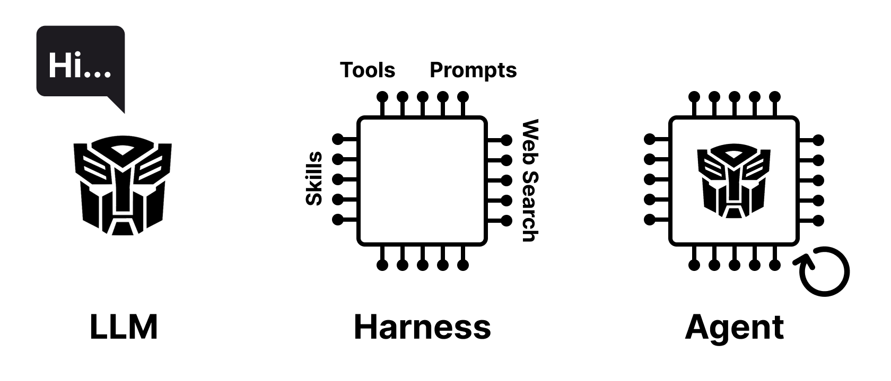
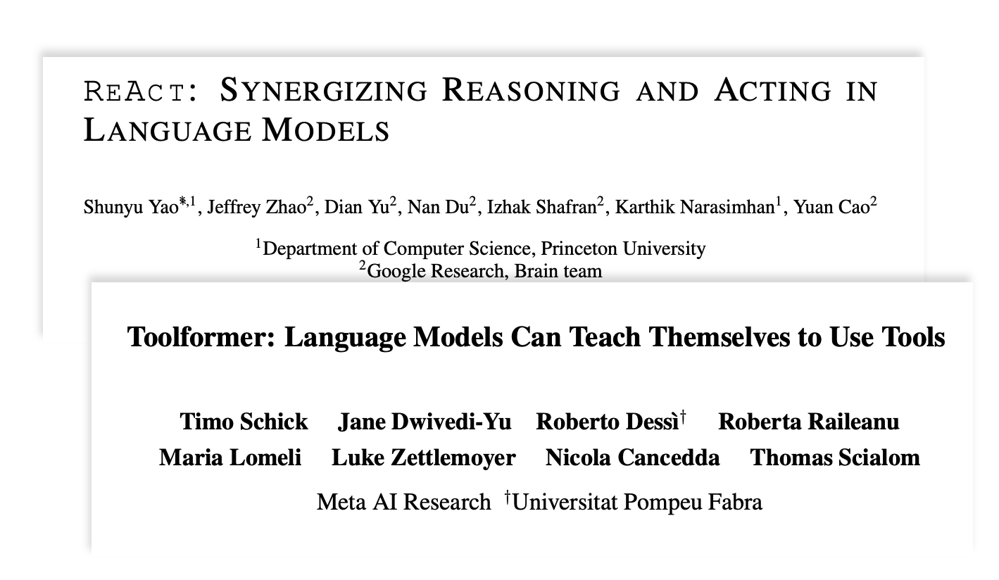
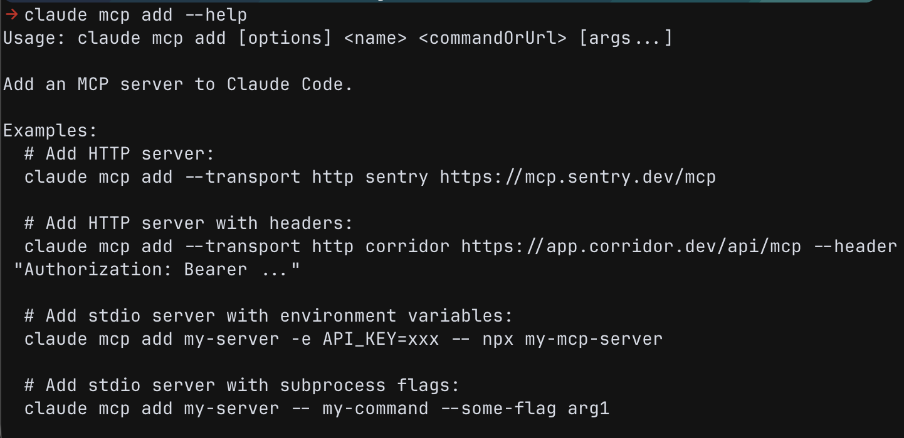

# Who am I?

---

# Agenda

---

# Building With AI

<!-- columns: 1/1 -->

### 1. Writing Code with AI Agents

- LLMs / Harness / Agents
- Tools / MCP / Skills
- Context Management
- Development Workflow

|||

### 2. Integrating AI into your Projects

- SDKs + Libraries
- LLM Generation Parameters
- Structured Outputs
- Prompt Optimisation

---

# Part 1 — Writing Code with AI Agents

---

# How Writing Code Has Changed in 5 Years

- 2021: IntelliCode auto-complete _(single line)_
- 2022: GitHub Copilot _(multi-line completion)_
- 2023: ChatGPT boom _(conversational coding)_
- 2024: IDE plugins _(inline code editing)_
- 2025: Agentic Revolution, Agent CLIs, "vibe-coding" _(e.g. Claude Code)_
- 2026: Multi-agent orchestration apps _(e.g. Codex App)_

<!-- step -->
<div class="colloquium-spacer-md"></div>

```box
tone: accent
align: center
content: |
  Paradigm shift — Developer describes _intent_, the model produces _code_
```

Notes:
- From single line autocomplete to agents working autonomously for hours, submitting PRs 

---

# Task Completion Time Horizon

<!-- size: small -->
<!-- footnote: from https://metr.org/time-horizons/ -->


---

# LLM, Harness, Agent



---

# LLMs

<!-- columns: 1/1 -->

- The base models can only generate text! 
- Cannot read files, execute code, or interact with the outside world on their own
- All responses are generated from their training data and the prompt context
- Previous user and assistant messages are appended to the context for the next prompt

|||

```conversation
messages:
- role: user
  content: Can you help me with my DATA3404 assignment?
```

<!-- step -->

```conversation
messages:
- role: assistant
  content: Sure! What do you need help with?
- role: user
  content: I need to optimise this SQL query `SELECT * FROM orders WHERE YEAR(order_date) = 2025;`
```

<!-- step -->

```conversation
messages:
- role: assistant
  content: First, you should narrow the `SELECT` statement ...
```

---

# Think of LLMs as Functions

- LLMs can be thought of as _stateless functions_ that take a prompt as input and return generated text as output
- The prompt has a maximum length (context window)

$$
\text{LLM}(\text{prompt}) \rightarrow \text{response}
$$

<!-- step -->

- A multi-turn conversation is achieved by appending previous messages to the prompt context

<!-- step -->
 
- System message $s$, user messages $u_i$, assistant messages $a_i$, concatenation $\oplus$:

$$
\text{Turn 1:}\quad \text{LLM}(s \oplus u_1) \rightarrow a_1 \
$$ 

$$
\text{Turn 2:}\quad \text{LLM}(s \oplus u_1 \oplus a_1 \oplus u_2) \rightarrow a_2
$$

$$
\ldots
$$

---

# LLMs + Tool Calling

<!-- size: small -->
<!-- columns: 1/1 -->
<!-- footnotes: left -->

- Tool calling allows the model to interact with external tools and APIs
- The system prompt describes the available tools and how to call them
- Special tokens (e.g. `<|call|>` in the _gpt-oss_ ^[Harmony response format:<br>https://developers.openai.com/cookbook/articles/openai-harmony] model) indicate the model wants to call a tool
- The **wrapper code** executes the function call and feeds the result back to the model


<!--  -->


|||

<div class="text-sm">

```conversation
messages:
- role: System
  content: You have access to the `get_current_weather(location)` tool ...
- role: user
  content: Can you tell me the temperature in Sydney right now?
```

<!-- step -->

```conversation
messages:
- role: assistant
  content: Let me fetch that information for you...
- role: assistant
  content: >-
    `<|start|>assistant<|channel|>commentary` `to=functions.get_current_weather<|message|>` `{"location": "Sydney"}<|call|>`

```

<!-- step -->

```conversation
messages: 
- role: user
  content: >-
    `<|start|>functions.get_current_weather` `to=assistant<|channel|>commentary<|message|>` `{"sunny": true, "temperature": 20}<|end|>`
- role: assistant
  content: The current temperature in Sydney is 20°C and it's sunny!
```
</div>

---

# Model Context Protocol (MCP)

<!-- size: small --> 
<!-- rows: 3/7 -->

- MCP is an open standard protocol for tool calling (proposed by Anthropic, 2024)
- An MCP server provides a collection of tools for the model to use (locally via stdio or remote via http)
- Many open source MCP servers available, e.g. https://mcpservers.org
- Or build your own, it's easy! (try [FastMCP](https://gofastmcp.com) for Python)

===

<!-- row-columns: 2/1/2 -->



|||


|||


---

# Skills

<!-- columns: 3/2 -->

- **Tools / MCP** give the model new capabilities
- **Skills** are "user manuals" for the model, <br>describing **how** to do something
- Just markdown + code files with naming conventions

```text
custom-pdf-analyzer/
├── SKILL.md                 # Required: Contains YAML frontmatter
├── scripts/                 # Optional: Helper execution scripts
│   ├── extract_text.py
│   └── summarize.py
├── references/              # Optional: Deep references / guides
│   ├── data-dictionary.md
│   └── formatting-rules.md
└── resources/               # Optional: Static templates or assets
    └── output-template.json
```

|||


---

# Harness

<!-- footnote-right: Blog post on Coding Harnesses: https://thoughts.jock.pl/p/ai-coding-harness-agents-2026 -->

- A harness is the wrapper around an LLM + tools + prompts + skills
- Common tools: file system access (bash), web search, code execution

<div class="colloquium-spacer-md"></div>

| Provider | Harness | Default Model | Notes | 
| --- | --- | --- | --- |
| OpenAI   | **Codex**   | GPT-*         | CLI, VSCode plugin or stand-alone app | 
| Anthropic | **Claude Code** | Claude * | CLI or VSCode plugin |
| Google | **Antigravity** | Gemini * | CLI or stand-alone app |
| Microsoft | **Github Copilot** | * |  VSCode integration |
| Cursor | **Cursor** | * | Own IDE, forked from VSCode |
| Open Source | **Pi** | * | CLI, highly customisable |
| ... | ... | ... | ... |

---

# Agents

<!-- columns: 1/1 -->

- LLM operates inside harness over many turns, calling tools to achieve a goal
- Has access to e.g. `shell()`, `read()`, `write()`, `patch()`, `web_search()`, etc. depending on the tools provided by the harness

<!-- step -->

- Not specific to coding tasks
  - "Read these 10 papers, group by theme, and compile a prioritised reading list with summaries"
  - "Go through my emails from last week, find any action items and add them to my task manager"
|||

```conversation
size:  0.55
messages:
  - role: user
    content: "Implement GitHub issue #123 and submit a PR"
  - role: assistant
    content: `shell("gh issue view 123")`
  - role: assistant
    content: `read("src/auth.ts")`
  - role: assistant
    content: `patch("src/auth.ts", "...")`
  - role: assistant
    content: `shell("npm test")`
  - role: assistant
    content: `shell("git commit -am 'Fix #123'")`
  - role: assistant
    content: `shell("gh pr create --fill --base main --head fix-123")`
  - role: assistant
    content: "PR opened: fixes #123. All tests passing."
```

---

# Context fills up fast!

<!-- size: small -->
<!-- img-align: center -->

- Additional notation: $t_i$ = tool calls, $r_i$ = tool results 
- tool results include read files, web searches, test outputs, API responses, ...

$$
\text{LLM}(\underbrace{s \oplus u_1 \oplus a_1 \oplus t_1 \oplus r_1 \oplus \dots \oplus t_{n} \oplus r_{n}}_{\text{entire agent history}})
$$


---

# Compactions

- If you get close to the context limit, the harness will automatically "compact" the history

$$
\text{LLM}(s \oplus u_1 \dots \oplus t_{n} \oplus r_{n} \oplus \text{"Summarise the conversation"}) \rightarrow \text{summary}
$$

<!-- step -->

- Summary is lossy, subsequent LLM calls operate on the summary

$$
\text{LLM}(s \oplus \text{summary} \oplus \text{"Continue with the current task"}) \rightarrow t_{n+1} \dots
$$


<!-- step -->
<div class="colloquium-spacer-md"></div>
 
```box
tone: surface
align: left
content: |
  **Tip**: Avoid auto-compactions, use manual `/compact` at logical breakpoints
```

<!-- step -->
 
```box
tone: surface
align: left
content: |
  **Tip**: Start a fresh session for each new task
```


---

# Context Management


---


# References

<!-- size: small -->

- "AI Tools for Research" Slide Deck by David Adams: https://github.com/Dadams2/ai_tools_for_research


---

# Appendix

---

# Frontier and Open Source LLMs

- Open models are lagging behind frontier models by ~ 1-2 years, but the gap is narrowing

<div class="colloquium-spacer-md"></div>

| Provider | Model | Context Window | Open Weights |
| --- | --- | --- | --- |
| Anthropic | Claude Sonnet 4.6 / Opus 4.7 | 1M tokens |  no |
| OpenAI    | GPT-5.5 | 1M (API), 400k (Codex) | no |
| Google    | Gemini 3.5 Flash | 1M tokens | no |
| Alibaba   | Qwen 3.6 | 262k tokens | yes | 
| DeepSeek  | DeepSeek v4 | 1M tokens | yes | 
| Moonshot AI | Kimi K2.6 | 256k tokens | yes | 

