# Building With AI

<!-- rows: 3/7 -->

### I. Evolution of Agents

- Thinking, Tool Calling, Skills, Model Context Protocol, Harness

===

<!-- row-columns: 1/1 -->

### II. Writing Code with AI Agents

- Context Management
- Compactions
- Plan Mode
- Development Workflow

|||

### III. Integrating AI into your Projects

- SDKs
- LLM Generation Parameters
- Structured Outputs
- Evals + Prompt Optimisation

---

# Part I — Evolution of Agents

---

# Task Completion Time Horizon

<!-- size: small -->
<!-- img-align: center -->
<!-- footnote: from https://metr.org/time-horizons/ -->

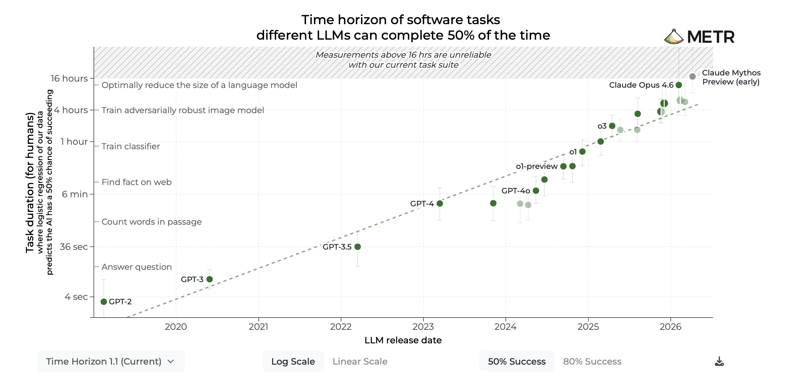

---

# LLMs are stateless functions

<!-- columns: 5/3 -->
<!-- size: small -->

- LLMs are **stateless functions** that take text (prompt) as input and return text as output
- The prompt has a maximum length ("context window")

$$
\text{LLM}(\text{prompt}) \rightarrow \text{response}
$$

- All other capabilities are built on top of this basic functionality

|||

```conversation
messages: 
  - role: user
    content: Write a haiku about databases
  - role: assistant
    content: |
      Silent rows of data\n
      Queries drift through midnight disks\n
      Truth waits to be found
```

----

# LLMs + Thinking

<!-- columns: 1/1 -->

- Allow the model to have an **internal monologue**
- Reduces hallucinations and elicits reasoning capabilities

<div class="colloquium-spacer-md"></div>

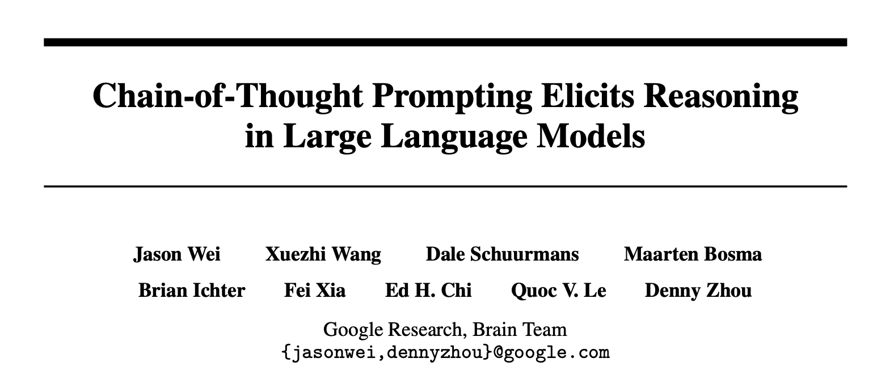

|||

```conversation
messages: 
  - role: user
    content: Write a haiku about databases
  - role: assistant
    content: _The user wants me to write a haiku about databases. A haiku is a traditional Japanese poem with three lines following a 5-7-5 syllable structure. It usually captures a fleeting observation, mood, or image with simplicity and subtlety._
  - role: assistant
    content: |
      Silent tables hum\n
      Queries wander through dark shards\n
      Answers bloom at dawn
```


---

# Conversational LLMs

<!-- columns: 3/2 -->
<!-- size: small -->

- A **multi-turn conversation** is achieved by appending previous messages to the prompt

<!-- step -->
 
- System message $s$, user messages $u_i$, assistant messages $a_i$, concatenation $\oplus$:

$$
\text{Turn 1:}\quad \text{LLM}(s \oplus u_1) \rightarrow a_1 \
$$ 

$$
\text{Turn 2:}\quad \text{LLM}(s \oplus u_1 \oplus a_1 \oplus u_2) \rightarrow a_2
$$

$$
\ldots
$$

|||

```conversation
messages:
- role: system
  content: You are a helpful assistant.
- role: user
  content: Can you help me with my DATA3404 assignment?
- role: assistant
  content: Sure! What do you need help with?
- role: user
  content: I need to optimise this SQL query `SELECT * FROM orders WHERE YEAR(order_date) = 2025;`
- role: assistant
  content: First, you should narrow the `SELECT` statement to only the columns you need...
```

---

# LLMs + Tool Calling

<!-- size: small -->
<!-- columns: 1/1 -->
<!-- footnotes: right -->

- Tool calling allows the model to interact with external tools and APIs
- The system prompt describes the available tools and how to call them
- Special tokens (e.g. `<|call|>`) indicate the model wants to call a tool
- The **wrapper code** executes the function call and feeds the result back to the model


<!-- 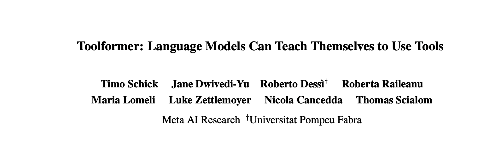 -->


|||

<div class="text-sm">

```conversation
messages:
- role: System
  content: You have access to the `get_current_weather(location)` tool ...
- role: user
  content: Can you tell me the temperature in Sydney right now?
```

<!-- step -->

```conversation
messages:
- role: assistant
  content: Let me fetch that information for you...
- role: assistant
  content: >-
    `<|start|>assistant<|channel|>commentary` `to=functions.get_current_weather<|message|>` `{"location": "Sydney"}<|call|>`

```

<!-- step -->

```conversation
messages: 
- role: user
  content: >-
    `<|start|>functions.get_current_weather` `to=assistant<|channel|>commentary<|message|>` `{"sunny": true, "temperature": 20}<|end|>`
- role: assistant
  content: The current temperature in Sydney is 20°C and it's sunny!
```
</div>

---

# Model Context Protocol (MCP)

<!-- size: small --> 
<!-- rows: 3/7 -->

- MCP is an open standard protocol for tool calling (proposed by Anthropic, 2024)
- An MCP server provides a collection of tools for the model to use (locally via stdio or remote via http)
- Many open source MCP servers available, e.g. https://mcpservers.org
- Or build your own, it's easy! (try [FastMCP](https://gofastmcp.com) for Python)

===

<!-- row-columns: 2/1/2 -->


|||

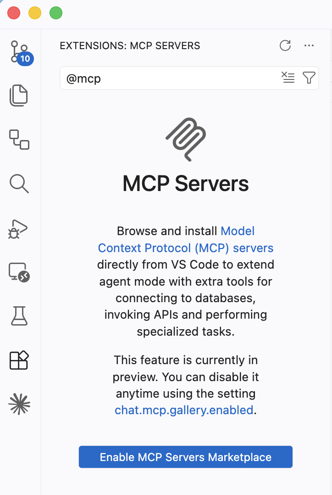

|||

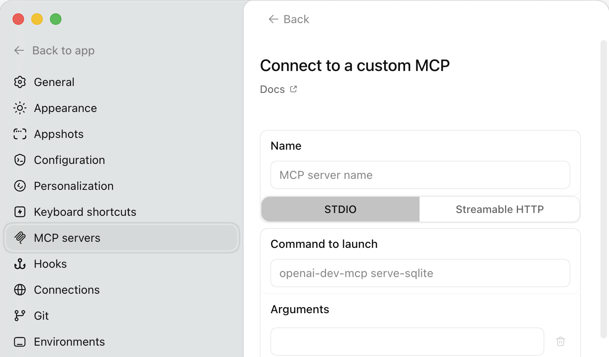

----

# Skills

<!-- columns: 3/2 -->

- **Tools / MCP** give the model new capabilities
- **Skills** are "user manuals" for the model, <br>describing **how** to do something
- Just markdown + code files with naming conventions

```text
custom-pdf-analyzer/
├── SKILL.md                 # Required: Contains YAML frontmatter
├── scripts/                 # Optional: Helper execution scripts
│   ├── extract_text.py
│   └── summarize.py
├── references/              # Optional: Deep references / guides
│   ├── data-dictionary.md
│   └── formatting-rules.md
└── resources/               # Optional: Static templates or assets
    └── output-template.json
```

|||

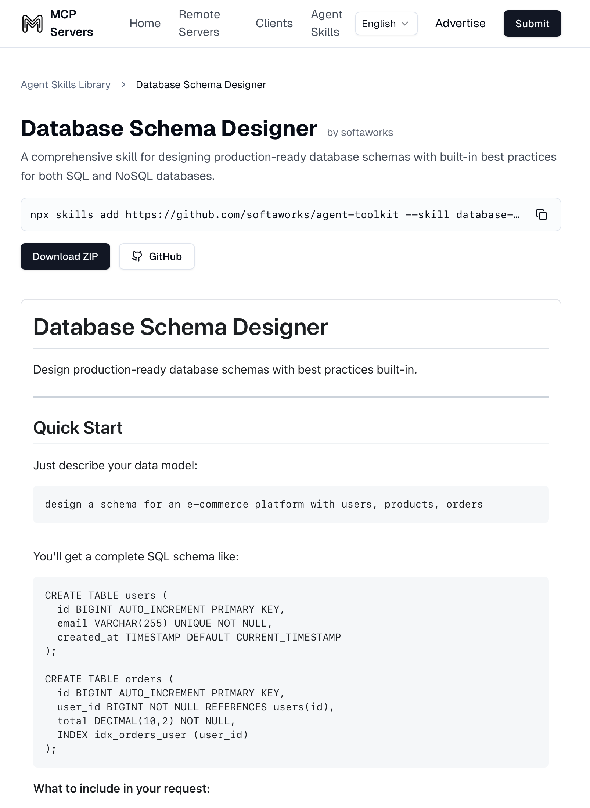

---

# Harness

<!-- footnote: Blog post on Coding Harnesses: https://thoughts.jock.pl/p/ai-coding-harness-agents-2026 -->

- A harness is the wrapper around an LLM + tools + prompts + skills
- Common tools: file system access (bash), web search, code execution, ...

<div class="colloquium-spacer-md"></div>

| Provider | Harness | Default Model | Access through... | 
| --- | --- | --- | --- |
| OpenAI   | **Codex**   | GPT-*         | CLI, VSCode plugin or stand-alone app | 
| Anthropic | **Claude Code** | Claude * | CLI or VSCode plugin |
| Google | **Antigravity** | Gemini * | CLI or stand-alone app |
| Microsoft | **Github Copilot** | * |  VSCode integration |
| Cursor | **Cursor** | * | Own IDE, forked from VSCode |
| Open Source | **Pi** | * | CLI + extensions |
| ... | ... | ... | ... |


---

# Agent = loop(LLM + Harness)

<!-- img-align: center -->

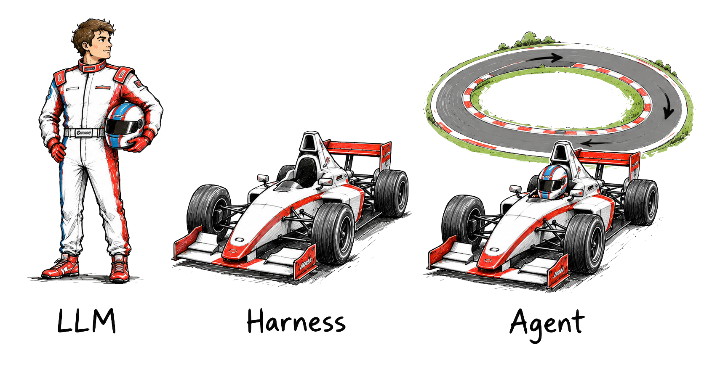

---

# Agents

<!-- columns: 1/1 -->

- LLM operates inside harness over many turns, calling tools to achieve a goal
- Has access to e.g. `shell()`, `read()`, `write()`, `patch()`, `web_search()`, etc. depending on the tools provided by the harness

<!-- step -->

- Not specific to coding tasks
  - "Read these 10 papers, group by theme, and compile a prioritised reading list with summaries"
  - "Go through my emails from last week, find any action items and add them to my task manager"
|||

```conversation
size:  0.55
messages:
  - role: user
    content: "Implement GitHub issue #123 and submit a PR"
  - role: assistant
    content: `shell("gh issue view 123")`
  - role: assistant
    content: `read("src/auth.ts")`
  - role: assistant
    content: `patch("src/auth.ts", "...")`
  - role: assistant
    content: `shell("npm test")`
  - role: assistant
    content: `shell("git commit -am 'Fix #123'")`
  - role: assistant
    content: `shell("gh pr create --fill --base main --head fix-123")`
  - role: assistant
    content: "PR opened: fixes #123. All tests passing."
```

---

# Multi-Agent Systems

<!-- size: small -->
<!-- img-align: center -->
<!-- footnote: From https://medium.com/@learning_37638/agentic-patterns-architectures-for-coordinated-ai-systems-34d9d8d8e1e2 -->

How can we squeeze out even more "performance"?

- Run multiple agents in parallel
- Coordination effort: orchestration, communication, shared memory, ...

<div class="colloquium-spacer-sm"></div>

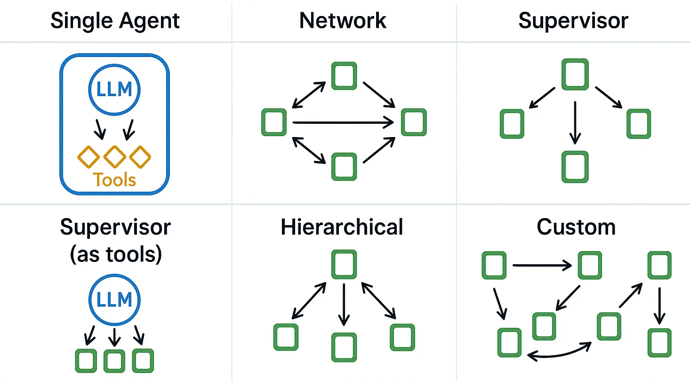

---

# Part II — Writing Code with AI Agents

---

# How Writing Code Has Changed in 5 Years

<!-- columns: 4/1 -->

- 2021: IntelliCode auto-complete _(single line)_
- 2022: GitHub Copilot _(multi-line completion)_
- 2023: ChatGPT boom _(conversational coding)_
- 2024: IDE plugins _(inline code editing)_
- 2025: Agentic Revolution, Agent CLIs, "vibe-coding" _(e.g. Claude Code)_
- 2026: Multi-agent orchestration _(e.g. Claude "ultracode" and dynamic workflows)_

<!-- step -->
<div class="colloquium-spacer-md"></div>

```box
tone: accent
align: center
content: |
  Paradigm shift: Developer describes _intent_, the model writes _code_
```

Notes:
- From single line autocomplete to agents working autonomously for hours, submitting PRs 

|||

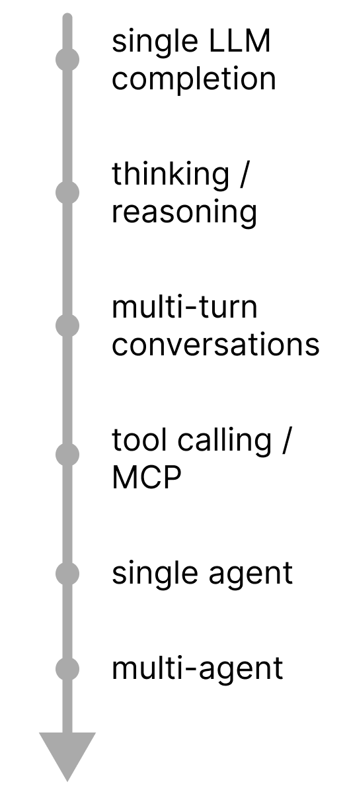

---

# Agent context fills up fast!

<!-- size: small -->
<!-- img-align: center -->

- Additional notation: $t_i$ = tool calls, $r_i$ = tool results 
- tool results include read files, web searches, test outputs, API responses, ...

$$
\text{LLM}(\underbrace{s \oplus u_1 \oplus a_1 \oplus t_1 \oplus r_1 \oplus \dots \oplus t_{n} \oplus r_{n}}_{\text{entire agent history}})
$$

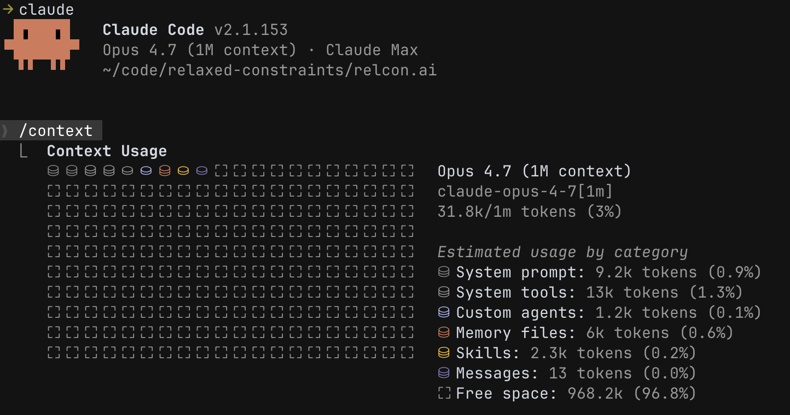

---

# Context Management

<!-- columns: 1/1 -->
<!-- size: small -->
<!-- footnote: https://claude.com/blog/using-claude-code-session-management-and-1m-context -->

- Actively manage the agent's context to keep it short and relevant

<!-- step -->

```box
tone: surface
align: left
content: |
  **Tip**: Create file-based artifacts (e.g. `.md` files), ask agent to re-read in new session
```

<!-- step -->

```box
tone: surface
align: left
content: |
  **Tip**: Use sub-agents to search code bases, summarise papers, read documentation
```

<!-- step -->

```box
tone: surface
align: left
content: |
  **Tip**: Use **rewind feature** instead of "undo this change"
```

|||

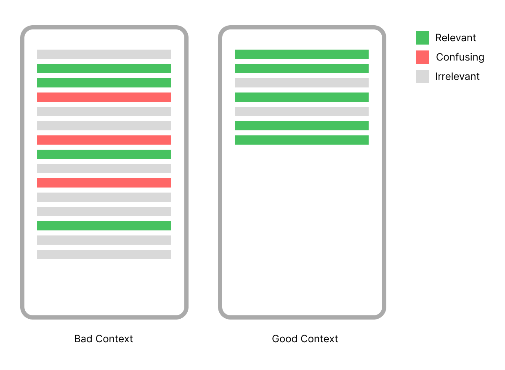

---

# Compactions

- If you get close to the context limit, the harness will **automatically compact** the history

$$
\text{LLM}(s \oplus u_1 \dots \oplus t_{n} \oplus r_{n} \oplus \text{"Summarise the conversation"}) \rightarrow \text{summary}
$$

<!-- step -->

- Summary is lossy, subsequent LLM calls operate on the summary

$$
\text{LLM}(s \oplus \text{summary} \oplus \text{"Continue with the current task"}) \rightarrow t_{n+1} \dots
$$


<!-- step -->
<div class="colloquium-spacer-sm"></div>
 
```box
tone: surface
align: left
content: |
  **Tip**: Avoid auto-compactions, use manual `/compact` at logical breakpoints
```

<!-- step -->
 
```box
tone: surface
align: left
content: |
  **Tip**: Start a fresh session for each new task
```

---
 
# Plan Mode

<!-- columns: 4/3 -->
<!-- size: small -->

- Most coding harnesses have a special **Plan Mode**
- No edits allowed
- Built-in prompts to encourage the agent to understand requirements, break down the problem, ...
- Agent creates a detailed implementation plan for your review

<!-- step -->

```box
tone: surface
align: left
content: |
  **Tip**: Spend most of your time in Plan Mode, iterate until you have a solid 
  plan before any implementations.
```

<!-- step -->

```box
tone: surface
align: left
content: |
  **Tip**: Even if there is no dedicated "Plan Mode", you can achieve the same through prompting.
```

|||

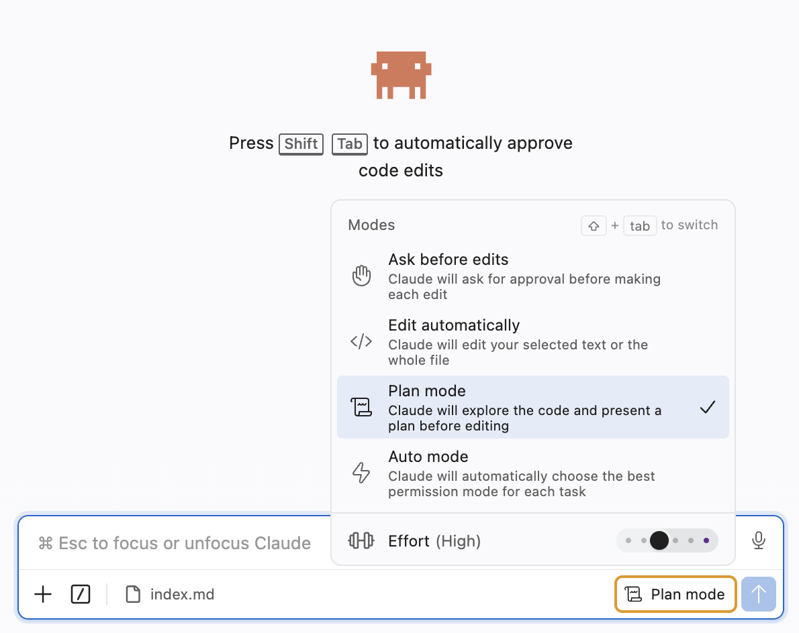


----

# Be specific! 

- Frontier models are extremely steerable, but... 
- They need to know the exact requirements and constraints
  1. What software stack
  2. Detailed feature description
  3. How they can verify their work (e.g. tests, acceptance criteria)
  4. Coding style and formatting rules


----

# Example Workflow

<!-- size: small -->
<span class="text-sm">

### Instead of

"Build a MongoDB storage layer for my app!"

<!-- step -->

### Do this

1. Use a sub-agent to summarise the architecture of the current app
<!-- step -->
2. Read these files and describe the current storage layer API in more details 
<!-- step -->
3. Read this documentation about MongoDB (link) with a sub-agent and summarise the key features we need for a MongoDB storage layer for our app
<!-- step -->
4. Create an implementation plan in markdown under `planning/mongodb-storage.md` with the following requirements: 1... 2... 3... 
<!-- step -->
5. Let's iterate on the implementation plan, make the following changes ....
<!-- step -->
6. Think through edge cases and include a thorough test plan in the planning doc
<!-- step -->
7. _[start fresh session]_
<!-- step -->
8. Read `planning/mongodb-storage.md` and point out gaps in the plan, uncertainties, risks
<!-- step -->
9. _[start fresh session]_
<!-- step -->
10. Build Phase 1 of the plan `planning/mongodb-storage.md`

</span>

---

# Build High Quality Software

<!-- size: small -->

```box
tone: surface
align: left
content: |
  **Tip**: Build software like it's open source and used by others, **even for research projects**.
```
<!-- step -->

<span class="text-sm">

- Use common package managers (`uv`, `pip`, `npm`, ...)
- Add tests for core functionality + test coverage
- Set up automatic formatting and linting (Python: `ruff`, JS/TS: `eslint`, `prettier`, ...)
- Write docstrings + comments in the code
- Use types (Python type annotations, TypeScript over Javascript)
- Use `git` / GitHub workflows: feature branches, pull requests, code reviews, CI
- Include development workflow instructions in `CLAUDE.md` / `AGENTS.md`

</span>

<!-- step -->

<div class="colloquium-spacer-sm"></div>

```box
tone: accent
align: left
title: Benefits
content: |
  - AI is familiar with this setup: was trained on all open source code
  - You can have confidence that AI-generated code actually works
  - Models benefit from these best practices (e.g. run tests to verify their work)
  - One-time investment to learn the tools -> pays off for every future project
```

---

# Part III — Integrating AI into your Projects

---

# What's the difference?

Writing code with AI agents:

- **You interact** with an AI agent, **through a product**, that writes code for you

<div class="colloquium-spacer-md"></div>

<!-- step -->

Integrating AI into your projects:

- **You write code** that calls an AI model, **through an API**, to achieve a task

<div class="colloquium-spacer-md"></div>

<!-- step -->
 
```box
tone: surface
align: center
content: | 
  **They are not mutually exclusive!** <br> You can still use coding agents to help you write code that integrates with AI.
```

---

# What do you actually need? 

<!-- columns: 4/1 -->

- What capabilities do you need for your project? 
- Often, single LLM completion is enough
- Trade-offs: cost, latency, complexity, reduced reproducibility, ...

<div class="colloquium-spacer-md"></div>

**Example**: LLM-based Query Generation (SQLStorm paper)

$$
\text{LLM}(\text{prompt + table schema}) \rightarrow \text{SQL query}
$$

|||


---

# Working with SDKs

<!-- columns: 4/3 -->
<!-- size: small -->

- Most providers offer SDKs in popular programming languages (Python, JavaScript, etc.)

- They offer fine-grained control over the model's generation parameters, e.g.:

  - Model selection
  - Reasoning effort (`none`, `low`, `medium`, ...)
  - Temperature (creativity)
  - Max tokens (response length)
  - Structured outputs (e.g. JSON)
  - Log probabilities
  - Token usage counts

|||

```python
from openai import OpenAI

client = OpenAI()
response = client.responses.create(
    model="gpt-5.5",
    instructions="You are a creative poet",
    input="Write a haiku about databases",
)
print(response.output_text)
```
<div class="colloquium-spacer-sm"></div>

```python
from google import genai
from google.genai import types

client = genai.Client()
response = client.models.generate_content(
    model="gemini-3.5-flash",
    config=types.GenerateContentConfig(
        system_instruction="You are a creative poet"),
    contents="Write a haiku about databases"
)
print(response.text)
```

---

# Temperature

<!-- size: small -->

- Skews the distribution of the next tokens (OpenAI: between 0-2, default=1)
- For evaluations, try lower temperature for more deterministic outputs (don't use 0)

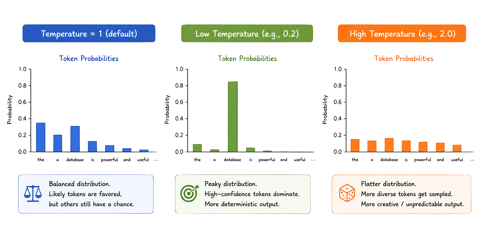

---

# Structured Outputs

<!-- size: small -->
<!-- rows: 1/5 -->

- Forces model to produce structured output (JSON)
- Pass in a JSON-Schema ([json-schema.org](https://json-schema.org)) object or `pydantic` model ([pydantic.dev](https://pydantic.dev))

===

<!-- row-columns: 3/2 -->

```python
from pydantic import BaseModel

class ResearchPaperExtraction(BaseModel):
    title: str
    authors: list[str]
    abstract: str
    keywords: list[str]

response = client.responses.parse(
    model="gpt-5.5",
    input=[
        {"role": "system",
         "content": "You are an expert at structured data extraction." \
         "You will be given unstructured text from a research paper" \
         "and should convert it into the given structure."},
        {"role": "user", "content": "..."},
    ],
    text_format=ResearchPaperExtraction,   # <-- pass in the pydantic model
)

research_paper = response.output_parsed   # instance of ResearchPaperExtraction
```

|||

```python
{
  "title": "Application of Quantum Algorithms in Interstellar Navigation: A New Frontier",
  "authors": ["Dr. Stella Voyager", "Dr. Nova Star", "Dr. Lyra Hunter"],
  "abstract": "This paper investigates the utilization \
    of quantum algorithms to improve interstellar navigation \
    systems. By leveraging quantum superposition and \
    entanglement, our proposed navigation ...",
  "keywords": [
    "Quantum algorithms",
    "interstellar navigation",
    "space-time anomalies",
    "quantum superposition",
    "quantum entanglement",
    "space travel"
  ]
}
```

---

# Using Open Source Models

<!-- columns: 1/1 -->

- Running open source models is easy but requires a GPU with enough VRAM
- Apple Silicon (M1+) with unified memory can run smaller models (32GB RAM can run ~9B parameter models)
- Rent cloud GPUs (e.g. A100 - 80GB) for larger models (vast.ai ~ USD 0.70/hour)
- Advantage: Reduced costs, can be fine-tuned

|||

```bash
$ ollama pull qwen3.5:9b
```

```python
import ollama

response = ollama.generate(
    model="qwen3.5:9b",
    think=False,
    system="You are a creative poet",
    prompt="Write a haiku about databases"
)

print(response.response)
```

----

# Frontier and Open Source LLMs

- Open models are lagging behind frontier models by ~ 1-2 years, but the gap is narrowing

<div class="colloquium-spacer-md"></div>

| Provider | Model | Context Window | Open Weights |
| --- | --- | --- | --- |
| Anthropic | Claude Sonnet 4.6 / Opus 4.7 | 1M tokens |  no |
| OpenAI    | GPT-5.5 | 1M (API), 400k (Codex) | no |
| Google    | Gemini 3.5 Flash | 1M tokens | no |
| Alibaba   | Qwen 3.6 | 262k tokens | yes | 
| DeepSeek  | DeepSeek v4 | 1M tokens | yes | 
| Moonshot AI | Kimi K2.6 | 256k tokens | yes | 


---

# Evals 

<!-- footnote: See also https://www.anthropic.com/engineering/demystifying-evals-for-ai-agents -->

- Non-deterministic and natural language outputs require new evaluation methods
- Even harder for agentic systems generating long histories with tool calls

<!-- step --> 

- **LLM-as-a-judge** 
  - "Given the following criteria, evaluate the quality of this response on a scale of 1-10: ..."
  - "Which of these two responses is better and why? Response A: ... Response B: ..."

<!-- step -->

- Libraries like [Promptfoo](https://www.promptfoo.dev/) or [DeepEval](https://deepeval.com) can help automate LLM evaluation

---

# Automatic Prompt Optimisation

<!-- columns: 3/2 -->

- Manual prompt engineering is brittle
- Libraries like [DSPy](https://www.dspy.dev/) automate prompt optimisation
  - Instead of hard-coded prompts, you define "signatures" mapping inputs to outputs
  - DSPy uses different strategies (e.g. GEPA) to automatically improve prompts

<div class="colloquium-spacer-md"></div>

```python
haiku_signature = "subject -> haiku"
haiku_generator = dspy.Predict(haiku_signature)
result = haiku_generator(subject="databases")
print(result.haiku)
```

|||

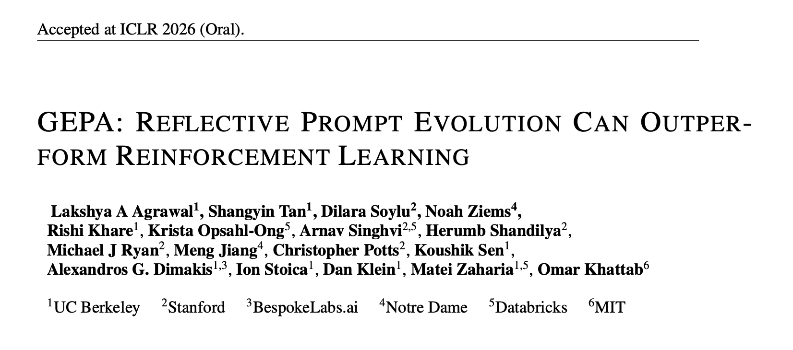

---

# Agent & Multi-Agent SDKs

<!-- columns: 4/1 -->

Higher level libraries for building agentic systems

- LangChain / LangGraph [https://www.langchain.com](https://www.langchain.com)
- Claude Agent SDK [https://code.claude.com/docs/en/agent-sdk](https://code.claude.com/docs/en/agent-sdk)
- OpenAI Agents SDK [https://openai.github.io/openai-agents-python](https://openai.github.io/openai-agents-python)
- CrewAI [https://crewai.com/open-source](https://crewai.com/open-source)
- Agno Agents [https://github.com/agno-agi/agno](https://github.com/agno-agi/agno)
- ...

|||


---

<!-- valign: center --> 

<span class="text-2xl">

> "You can outsource [thinking] coding, but you can't outsource understanding!"

</span>
